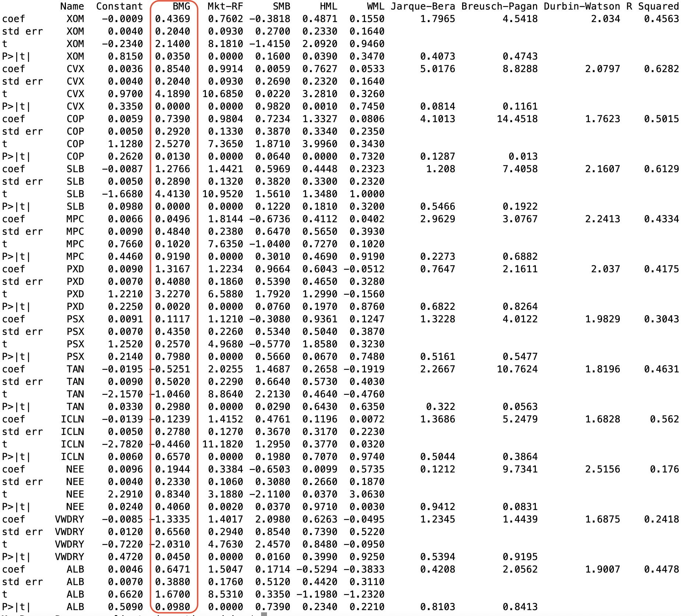
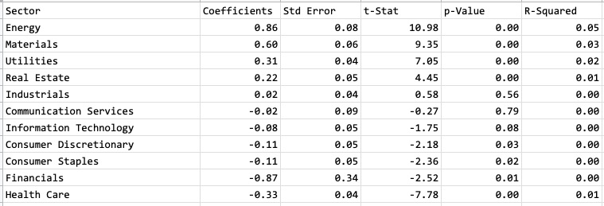
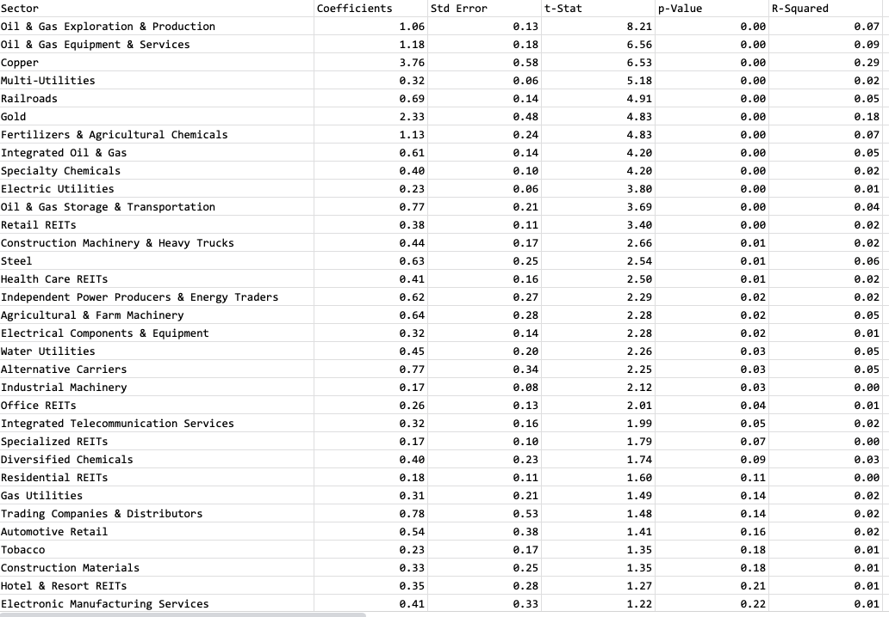

## Analyzing Investments

True story: I used to manage portfolios of mortgage backed securities.  These were very complex to analyze, because as interest rates changed, their rates of repayment changed.  As a result, their value relative to other bonds such as Treasuries would move differently as rates rose and fell.  

So we and other investors and traders used very complex models called "Option Adjusted Spread" or OAS models to evaluate them.  These models projected interest rates and then repayment rates of the mortgages for 30 years under thousands of different scenarios, then aggregated the scenarios to come up with values for securities in the present day.  The OAS models were calibrated to the market prices of treasury or interest rate swap rates and options, so that they, in effect, valued the mortgage backed securities against them.  This also allowed mortgages to be hedged with treasuries, swaps, and options, which is what mortgage hedge funds in fact did.  But since these OAS models all relied on models of prepayments based on historical analysis of the data, in effect these funds were making bets on the correctness of their prepayment models.

Then the markets moved in ways even these complex models couldn't predict: Rates fell a lot more than expected, and actual mortgage repayment rates were far higher than any models predicted.  As a result, the OAS models came up with results that nobody believed.  They were no longer useful for hedging or valuing securities.  Whoever still used them was in effect flying blind.

So one day, I thought "What if we ran the models backwards?"  This is commonly done when there is no fundamental model to evaluate an investment with.
Instead of plugging in parameters to calculate the price of, say, an option, you could 
plug in an option's market price to calculate the volatility that would get you that price.  This is called "implied volatility" and is actually how options of all sorts are traded.  Traders use it trade different options versus each other, and they also compare their own views of market volatility with what the market is thinking.

Along those lines, I came up with an implied prepayment model where I could put in the prices of securities and come up with a prepayment model that would fit those prices.  Then, I thought, I could compare that model with my own beliefs about future prepayments.  I could also use it to trade or hedge one group of securities with another.  I didn't actually get to use it much, but I did get a paper published (Yay!), and now I see that paper even got cited by other papers (Woohoo!)

Later, I met a Trader at a Big Firm.  This Big Firm had lots of analysts, including one of the best prepayment analysts on the Street.  But he just sat there by himself off to the side and kept sending us scatterplots that looked like this:

That's it???  There's no sophisticated quantitative finance at work.  It was a spreadsheet he maintained himself (I think) without any of the research
department's fancy models.  People thought of his scatterplots as something between a toy and a joke.  But as he told it, "This is the market's OAS model.  I've got the history of the market and all those analysts with
all their models to compare the current prices with.  That's better than any one person's model."  He was way ahead of all the Wisdom of the Crowd talk that's in vogue nowadays, 
but it worked well for him.  This market-based model helped him identify mispricings and opportunities where big fancy models failed.  He went on to be _very_ successful.  

Today we're told that ESG or climate investing is hard because it's hard to get the data and hard to interpret them.  Hard to know which long-term scenario to use and how to 
analyze them.  But this is nothing new, and there is a way to get around these problems.  Let the market tell you.  There are hundreds, probably thousands, of smart people already looking at the climate risks of all sorts of 
traded investments such as stocks and futures.  You can piggy back on all the time and money they spent on data services, computer models, and research -- for free!  All you need is market prices, a computer, and some [models](https://github.com/opentaps/open-climate-investing) -- which we gave you for free!

There are some very successful investors who only trade with market implied models and do no fundamental research.
For most investors, though, this kind of market implied model is not the end, maybe not even the beginning of the end, but it is the end of the beginning.
It is a good way to quickly flag down opportunities, such as mispricings between securities and differences between the market's thinking and your fundamental analysis.
It is a great check on your analysis, those "Am I Sure?" moments that could save your career.  It is also the best way to make sure that a fund you're sold really does
what they said it would do.

### Market Implied Model

_"Come on pal.  Tell me something I __don't__ know.  It's my birthday.  Surprise me." - Gordon Gekko_

Now let's take a closer look at the market implied model.  First a little bit about how these models came about.

Long ago (up to the 1950's), investing meant sifting through financial statements, combing through the news wires, and scuttling about for every little "butt" of information about companies.  Then in the early 1960's, a young group of
finance professors revolutionized the field by saying none of that mattered.  In fact, it didn't even matter if you knew you were investing in livestock or preferred stock.  All that mattered was how the assets you owned
moved with the overall market.  That could be summarized in a simple statistic, called the _Beta_, which could be calculated from a regression of the returns of an asset versus the returns of the market.  Once you had this Beta,
you could tell how risky an asset was, how two assets should move versus each other, and whether an asset returned enough to compensate for its risks.  

This revolutionary insight turned finance into a quantitative field.  Today few finance departments teach investing the way Ben Graham taught it to Warren Buffett.  The top traders at hedge funds are more likely to be 
physicists than accountants.  And though it is still vociferously by the "stock pickers" in the industry, the truth is that this new way of thinking, called "Modern Portfolio Theory," worked well -- in some important applications:

 * It's great for finding short-term mispricings and trade around them.  If two stocks are supposed to move together at a certain ratio with high probability, and one moves first, it's (usually) a good bet the other will move soon.
 * It's great for analyzing the performance of portfolios.  While the investment industry touts its stock picking prowess, most funds contain so many stocks, their returns could be reduced to statistical relationships versus major index returns.

But the first model of Modern Portfolio Theory, called "Capital Asset Pricing Model" with the single Beta, was just the beginning.  Over time, the quants did find that other  
statistically significant factors in returns.  The [Fama French 3-factor model](https://rady.ucsd.edu/faculty/directory/valkanov/pub/classes/mfe/docs/fama_french_jfe_1993.pdf) from 1993 became popular because it added two more parameters, one for size and one for balance sheet leverage.  This was followed up by the [Carhart 4-factor model](https://doi.org/10.1111/j.1540-6261.1997.tb03808.x) from 1997, which introduced a fourth factor, momentum. Today there are ever more sophisticated factor models with ever more factors, such as the [MSCI BARRA Multi Factor Model](http://cslt.riit.tsinghua.edu.cn/mediawiki/images/4/47/MSCI-USE4-201109.pdf).

For analyzing climate risk, we found one such model: [Carbon Risk Management (CARIMA)](https://www.uni-augsburg.de/de/fakultaet/wiwi/prof/bwl/wilkens/sustainable-finance/downloads/).  It was developed by Universtat Augsburg 
with funding from the German Federal Ministry of Education and Research.  CARIMA is a multi-factor market returns model based on the Fama French and Carhart models plus an additional risk factor for climate risk.  Its risk factors are:

 * Market: Returns of the market over the riskfree rate, similar to the original Beta from CAPM 
 * SMB: Small Minus Big, the return difference of small cap stocks vs large cap stocks
 * HML: High Minus Low, the return difference of stocks with high book equity/market equity vs low book equity/market equity.  The stocks with high book equity/market equity are usually companies in financial distress (ie, banks where the market sees more credit losses than has been written down), while the stocks with low book equity/market equity are usually high-growth companies (ie, tech companies without much earnings.)
 * WML: Winners Minus Losers, the return difference of stocks with high momentum (winners) vs low momentum 
 * BMG: Brown Minus Green, the return difference of stocks with high climate risk (Brown) vs low climate risk (Green)
 
What this model does is explain the sensitivity of any asset (could be a stock or a fund, or even futures on commodities -- anything that is traded would work) based on the return differential of stocks with high carbon risk (Brown) vs
those with low carbon risk (Green).  The original research paper provided a data series for the Brown Minus Green (BMG) factor until the end of 2018.  With this model, we could now get the market's measure of the climate risk of a
stock by seeing how its prices have behaved.  In other words, what do all those smart people pouring through carbon disclosures, ESG data, and running scenarios, not to mention analyzing the company's business model, assets, and 
operations, really think?

Most importantly, we have turned all those disclosures, data, and scenarios -- the vague ESG stuff that make portfolio managers say "How do I monetize this?" (and traders say
"How the f@#! am I going to make money with this s#&!") -- into something you could trade with.  Furthermore, we've gotten around the commonly known problem of inconsistencies between ESG disclosures and scores by
using the market as the benchmark.   So using a market implied model, you don't have to bet on which ESG disclosure is "right."  You just have to be more right than what the market, as an aggregate, thinks.

Now let's see what it looks like with a few examples.  (Note that these examples use data up to the end of 2018, but the ideas are the same.)  We have taken the original model and created an [open source project](https://github.com/opentaps/open-climate-investing) which could be used to run it as scale and analyze large samples of stocks and portfolios over time.  You can check out the code and run it yourself.

#### Analyzing Stocks and Funds

First let's look at a list of [7 Best Oil Stocks to Buy](https://money.usnews.com/investing/investing-101/slideshows/best-oil-stocks-to-buy) and [7 Renewable Energy Stocks and ETFs to Consider](https://money.usnews.com/investing/stock-market-news/slideshows/renewable-energy-stocks-to-consider), and see what the market tells us about them:

Look in the "BMG" column: It shows the market implied carbon risk factor, along with its statistical significance, measured by standard error, t-statistic, and a probability for this t-statistic.  The larger the t-statistic, the smaller the probability measure, and the more significant this carbon risk factor is.

According to the market, Exxon-Mobil (XOM) has a carbon risk factor of 0.44, with T-statistic of 2.14 which means a probability of only 3.5% that this number could actually be zero.  So this means that Exxon's stock price is moving with high statistical significance relative to other high carbon (Brown) stocks.  Not surprising.  But is it surprising that Chevron (CVX) and ConocoPhillips have nearly twice the carbon risk factor, at 0.85 and 0.74, than Exxon, while Marathon Petroleum (MPC) has no carbon risk factor?  In other words, next time you see some big climate-related headline, should Chevron move twice as much as Exxon, while Marathon not much at all?  Or is 
the market in fact miscalling Exxon, Chevron, ConocoPhillips, and Marathon versus each other -- and there could be real trading opportunities here?

Next, look at Schlumberger (SLB) and Pioneer Natural Resources (PXD).  These oil exploration companies have carbon risk factors of about 1.3, nearly three times those of Exxon and 50% more than Chevron and ConocoPhillips.  Do these stocks in fact have higher carbon risk than the integrated oil majors?  Even a casual observer (like me) could see that they probably do: While the oil majors have large assets in the ground, which could potentially be extracted for different
purposes and at different prices in the future, the exploration companies are more dependent on drilling for new oil.  Therefore, a decline in demand for oil would probably more directly impact their business models.  But again,
the question is how much?  At least with a market based model, you know what hurdle you need to beat.

Then let's look at the renewables.  What's interesting about this list is that with the exception of Vesta Wind (VWDRY), _none_ of the renewable energy stocks and ETF's have statistically significant negative carbon risk factors. The Invesco Solar ETF (TAN) has a negative carbon risk factor of -0.52, but it is not statistically significant with a t-statistic of -1.05, meaning there is a 30% chance this statistic is actually null.  This means that
these stocks are in fact not falling when Brown (high carbon risk) stocks rise and vice versa.  Is this a problem with the BMG risk factor we've constructed?  Perhaps -- but then why is this statistics seemingly giving the
right numbers for the integrated oil majors and oil exploration stocks, not to mention Vesta Wind?  Is the market misvaluing these stocks, giving you opportunities to trade them for a profit?  Or are these companies in fact
not as green or low in carbon risk as we thought?

What interesting questions...

#### Analyzing Market Sectors

This model could also tell us what the market as a whole thinks about the climate transition.  Using the iShares Core S&P 500 ETF, we calculated the carbon risk factors of the major sectors of the S&P 500:

So we see that the market, as a whole, thinks that Energy has the highest carbon risk factors -- it is the most sensitive to climate change.  Makes sense in light of the strong carbon risk factors we got for both the oil majors
and oil exploration companies.  Then, interestingly enough, comes the Materials sector -- chemicals, paper, steel, and mining.  Then comes Utilities, followed by Real estate.  Industrials, Communications, Information Technology, and
Consumer products have very low sensitivities.  Finally very significant negative carbon risk factors for Health Care stocks.  The very high and significant negative carbon risk factors for Financials should be ignored, as the Fama French-style factor models are not recommended for these stocks.

What does this mean?  The market believes that energy and energy-intensive sectors are most as risk to climate change, probably through shifting demand and potential carbon taxes.  Utilities are less sensitive, presumably because
they could shift their fuel mix to renewables, and maybe their regulators would allow them to pass those on to their customers.  Real estate companies even less so, because energy is not as big a part of their costs.  

Is this a logical transition scenario?  That's where "market implied" comes in.  Market implied means relative to other traded assets in the market.  _Relative to the other assets_, how risky is it?  Is it over- or undervalued?  And, most important of all, is the market missing something, or are you?  It also means that you can trade one set of assets against another, such as underweighting the stocks with higher climate risks than the market currently expects.

Let's take a closer look at the carbon risk factors by sub-sector of the S&P 500.  Generally a t-statistic above 2 is considered statistically significant (at a 5% confidence level), though given the current level of climate investing
knowledge, perhaps a 10% or 20% confidence level is still worth looking at.  Here again, we see patterns, some of which seem to make sense, some of which raise question marks:

 * It seems to make sense that the oil & gas exploration, production, and services stocks have such high carbon risk factors.
 * It also seems to make sense that fertilizers and agricultural chemicals have high carbon risk factors, but what should be the correct relative risk factors for this sector?
 * What causes such high carbon risk factors for copper and gold?
 * Should REITs really have higher carbon risk factors than electric and even natural gas utilities?
 * Is the risk factor for steel companies high enough, given the highly emissions of steelmaking?  Remember, a ton of steel on average produces 1.85 tons of GHG emissions.

Similar analyses could be performed on portfolios, dissecting their carbon risk factors to the sectors, sub-sectors, and individual stocks.  

### Fundamental Analysis

_"The most valuable commodity I know of is information" - Gordon Gekko_

I'm going to (figuratively) bet that given the limited awareness of climate among investors, the market is probably still missing a lot.  In other words, there are 
probably a lot of opportunities if you invested some time in analyzing companies' climate exposures.  Whereas the market implied model allowed you to cut out the whole issue of inconsistent data and disclosures, fundamental analysis is all about comparing different points and figuring out which one is actually right.  So let the market implied model be a starting point, and let's dig in.

Climate change is a long-term process with a lot of uncertainty.  How it plays out, and then how that affects an actual company, could depend on a number of scenarios.  Thus
analyzing climate exposure is, in many ways, similar to analyzing mortgage-backed securities:  You will need to project multiple scenarios far into the future, calculate their 
financial impacts, and then attach probabilities to the scenarios to arrive at their expected values today.  (Now you see why I needed to tell you aobut mortgages and OAS models.)

The key steps of this analysis are:

 * The company's current climate exposures: How much are its Greenhouse Gas (GHG) emissions now?  What are its assets?
 * How those exposures will change: Every company talks about "sustainability" these days.  What is it really doing to reduce its climate exposures or "decarbonize"?
 * Overlaying scenarios: How will potential events affect the company, given its current exposures and its path to decarbonize?
 * Valuing the scenarios: Under each scenario, what is the economic impact (positive or negative) to the company?
 * Comparing versus the market: Now the market implied values come in handy.

As you can see, climate investing is not as simple as divesting from oil companies.  Just like you wouldn't buy a stock based on its most recent earnings, you shouldn't just rely on 
current emissions to make climate investment decisions.  Instead, you have to account for both current positions, management actions, and potential long-term scenarios.  This is
what makes investing fun!

#### Data and Where to Get Them

The most basic data you will need is the emissions of a company.  While we usually talk about CO2 emissions, there are other gases that cause climate change and do a lot more damage.  According to the [EPA's Overview of Greenhouse Gases](https://www.epa.gov/ghgemissions/overview-greenhouse-gases), methane (CH4) is 25 times, nitrous oxides 300 times, and fluorinated gases 10,000 to 20,000 times more potent than CO2.  (Maybe that's why the agricultural chemicals, copper, and gold stocks
had such high carbon risk factors?)  All these gases are collectively called "Greenhouse Gases" (abbreviated "GHG"), and their emissions are converted to their CO2 equivalents, or "CO2e," based on these ratios.

Furthermore, companies emit GHG in a variety of activities.  The standard for GHG emissions reporting is the [GHG Protocol](https://ghgprotocol.org/), which breaks down a company's emissions into three scopes:

 * Scope 1 is emissions from fuel directly combusted on site at a company.  For example, utilities and steelmakers burning coal or natural gas, or airlines burning aviation fuel.
 * Scope 2 is emissions from energy purchased by a company.  For example, buildings purchasing electricity from a utility.
 * Scope 3 is emissions from all the upstream and downstream activities of a company.  It is a very broad category and includes all of the following and more:
    * Oil extracted by an oil company and burnt by an airline or car
    * Flights taken by employees of a company
    * Steel bought as raw materials
    * Shipping a product to customers
    * Using cloud-based servers (Yes, that includes your reading this article right now.)

_Source: [EPA Scope 3 Inventory Guidance](https://www.epa.gov/climateleadership/scope-3-inventory-guidance)_

Naturally, this means emissions are transferred between companies.  Natural gas that is extracted by an oil company is Scope 3 for the oil company, Scope 1 for the utility that uses it, and then Scope 2 for the office building that 
uses the electricity from the same utility.

Because Scope 3 emissions are so broad and tangled up and down the supply chain, they are the hardest to account for.  It is also what many climate investors analysts and ESG data providers are missing, and where some companies are 
deliberately trying to hide their climate exposures.  So be very careful about any analysis that does not include Scope 3 emissions.

So where do you get this information?  There are a lot of reporting standards out there, but let's take a look at a few common ones:

 * [CDP (Carbon Disclosure Project)](https://www.cdp.net/en) is a self-reported survey of carbon emissions and policies by companies.  Here is an example of [Adobe's response to CDP questionnaire](https://www.adobe.com/content/dam/cc/en/corporate-responsibility/pdfs/Adobe_CDP_Climate_Change_Questionnaire_2021.pdf).  The data they collect is available to paid subscribers.
 * Taskforce for Climate Finance Disclosure (TCFD) and Sustainable Accounting Standards Board (SASB) are general guidelines for reporting on climate and sustainability.  Take a look at the [TCFD disclosures](https://about.ups.com/content/dam/upsstories/assets/reporting/sustainability-2021/2020_UPS_TCFD_Report_081921.pdf) and [SASB disclosures](https://about.ups.com/content/dam/upsstories/assets/reporting/sustainability-2021/2020_UPS_SASB_Standards_Table_081921.pdf) for UPS as examples. 
 * [GRI](https://www.globalreporting.org/) is a more comprehensive set of sustainability reports, somewhere between the CDP's surveys and the disclosures of the TCFD and SASB.  Note [Adobe's Corporate Social Responsibility](https://www.adobe.com/content/dam/cc/en/corporate-responsibility/pdfs/Adobe-CSR-Report-2020.pdf) follows points from the GRI.  

Also note that some companies (Adobe) supply a third party audit letter, some companies (UPS) have their auditors review some of their disclosures, and others provide disclosures without any auditor backing.

#### Do Goals Matter?

Related to disclosures are organizations that help companies set climate goals.  They also provide helpful information about companies' climate exposures.  A few well known ones are:

 * [Science Based Target Initiative](https://sciencebasedtargets.org/) (SBTi) validates companies' climate targets against the Paris Agreement 1.5 degree goals.  They publish [standards for emissions reductions by industry](https://sciencebasedtargets.org/sectors), known as the [Sectoral Decarbonization Approach](https://sciencebasedtargets.org/sectors).  They publish a [list of companies taking action](https://sciencebasedtargets.org/companies-taking-action) under their emissions reduction targets.  There are currently 1750 companies with either approved targets or in the process (committed.)  
 * [Transition Pathway Initiative](https://www.transitionpathwayinitiative.org/) (TPI) assess management awareness of climate issues and carbon performance based on International Energy Agency (IEA) Energy Technology Perspectives report. 
 * [Climate Action 100+ Net Zero Benchmark](https://www.climateaction100.org/progress/net-zero-company-benchmark/) is focused on about 160 top emitting companies, relying in part on TPI data.  Their [2020 report](https://www.climateaction100.org/wp-content/uploads/2020/12/CA100-Progress-Report.pdf) has detailed information about the companies.

Importantly, note that these initiatives are very high level and do not actively monitor the companies' progress along their targets or commitments.  This is a big void in climate investing and an area we're working to address with an
open source [Investor Climate Disclosure Project](https://wiki.hyperledger.org/display/CASIG/Investor+Climate+Disclosures+Project).

Why do these targets matter?  Because they are a measure of a company's seriousness in addressing climate change.  While many companies now have departments who submit ESG surveys, few (only 5% to 25% of the S&P 500, for example) have committed
to meeting the goals of the Paris Agreement through SBTi or others.  Therefore, a commitment is by itself the sign of a climate leader.  (Follow through is something we as investors should hold the companies to.)  

Furthermore, if and when the world's economies follow their Paris Agreement's National Defined Contributions (NDC's), then the public policy and carbon task transition risks in those economies would probably follow the Paris Agreement goals.  Therefore, companies could be minimizing their risks by getting onboard with Paris Agreement goals early.  Time will tell, of course, but that's the point of the next part: Scenario analysis.

#### Scenario Analysis

In a [previous chapter](Climate-and-Investing.md) I went through the results of different analyses on the effects of climate change on investments.  Now let's take a closer look at how the analyses were done, so that we could perform similar analyses for our investments.  Analyzing the effects of climate is a multi-step process which involves projecting several key variables into the future:

 * Trajectory of Greenhouse Gas (GHG) emissions based on current trends
 * Effect of GHG emissions on changing the climate, both locally and globally
 * Physical effect of those climate changes, such as droughts or hurricanes   
 * Financial impact of those physical effects
 * Mitigation measures, such as the various policies to reduce emissions and "decarbonize"
 * Adaptation measures against the risks, including hardening infrastructure and reducing emissions

Physical risks are calculated by mapping assets, such as buildings or plants, and then running models for hazards such as hurricanes, flooding, and fires on the assets.  The models would project physical damage, which would then need to be converted into financial losses to calculate the additional expected loss due to climate risks and identify portfolio vulnerabilities.  There are both commercial models such as ClimateWise and FourTwentySeven and open source models such as [CLIMADA](https://github.com/CLIMADA-project/climada_python) that could be used. 

_Source: [NGFS Overview of Environmental Risk Analysis by Financial Institutions](https://www.ngfs.net/sites/default/files/medias/documents/overview_of_environmental_risk_analysis_by_financial_institutions.pdf)_

Transition risk requires a process of mapping changes in regulations and consumer demand on companies' financial results.  Typically, these scenario analyses incorporate changes in energy mix and technologies, such as switching from fossil fuels to renewables and electric vehicles.  They also incorporate carbon taxes, which are calculated against the companies' projected GHG emissions.  For example, here is an example from chapter 4 of the [NGFS Case Studies book](https://www.ngfs.net/sites/default/files/medias/documents/case_studies_of_environmental_risk_analysis_methodologies.pdf), where Oliver Wyman shows a calculation of the impact of carbon taxes on oil and gas exploration:

_Source: NGFS and Oliver Wyman_

This could then be extended into the financial results:

  

_Source: NGFS and Oliver Wyman_

Some useful guides on the scenarios themselves:

 * [TCFD The Use of Scenario Analysis in Disclosure of Climate-Related Risks and Opportunities](https://assets.bbhub.io/company/sites/60/2020/10/FINAL-TCFD-Technical-Supplement-062917.pdf) is a bit old, from 2017, but it describes in detail different scenarios from the IEA and a few others.  These scenarios show the increased need for biofuels, renewables, and nuclear energy, as well as carbon prices going up to $140/ton to $210/ton under some scenarios.
 * [NGFS Climate Scenarios for central banks and supervisors](https://www.ngfs.net/sites/default/files/media/2021/08/27/ngfs_climate_scenarios_phase2_june2021.pdf) is more up to date (2021.)  It covers a wide range of scenarios that span orderly transition to 1.5C, current trend to 3C, and sudden transitions after 2030 to reach 1.8C.  The carbon prices in these scenarios reach an amazing $800/ton in some cases.
 * [SBTi Sectoral Decarbonization Approach (SDA)](https://sciencebasedtargets.org/resources/files/Sectoral-Decarbonization-Approach-Report.pdf)	breaks down the path of emissions reduction necessary to reach 2C by industry, such as steel, cement, power generation.  A more updated version for reaching 1.5C target is in the works.    
 * [CarbonBrief's Explainer: The high-emissions ‘RCP8.5’ global warming scenario](https://www.carbonbrief.org/explainer-the-high-emissions-rcp8-5-global-warming-scenario) describes what the "Representative Concentration Pathways" are, how they were derived at, and why the RCP8.5 scenario that is often cited "Business as Usual" may be too severe.  (Some good news finally?)

### Who is Right?

_"Never tell me the odds." - Han Solo_

Han (aka the portfolio manager) may feel he knows exactly what he's doing when he attacks an Imperial Star Destroyer head on (aka doing a trade), but Princess Leia (aka plan sponsor) is rightly to be concerned, especially when C-3PO (aka plan consultant) is there to remind her what the odds are.

That's the problem with these statistical models of the market.  They can't tell you what will happen, just the odds--based on some preconditions.  C-3PO may know the odds of surviving a direct attack on an Imperial Star Destroyer, but nobody tried it the way Han did it.
