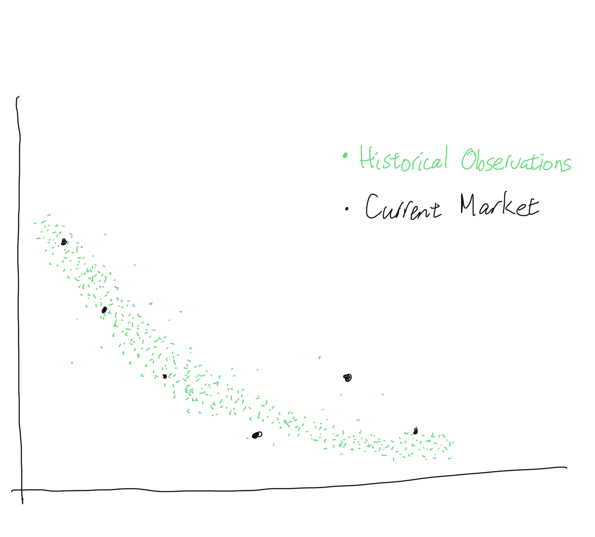
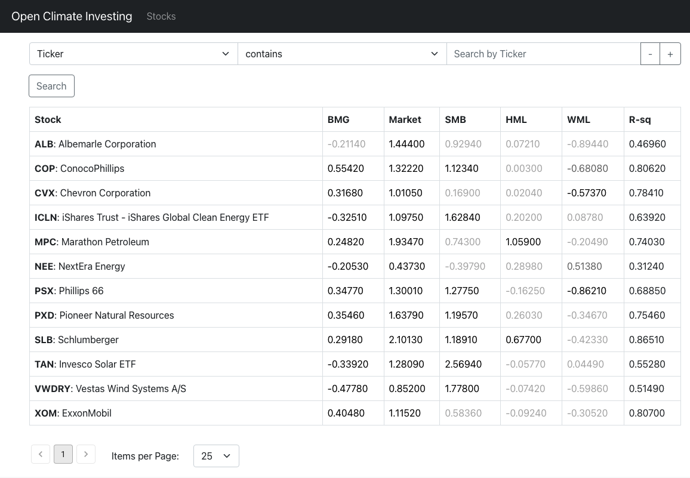
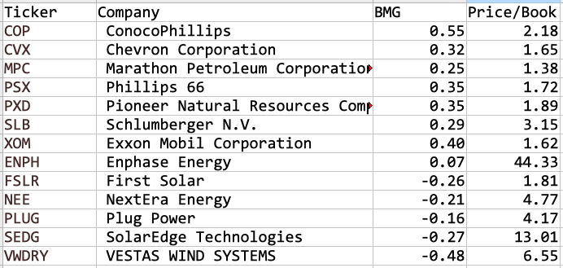
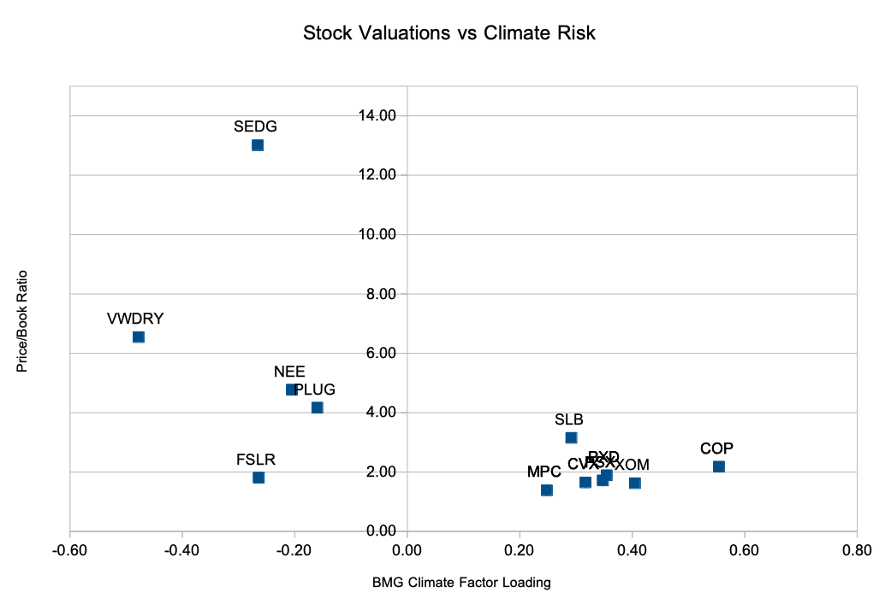
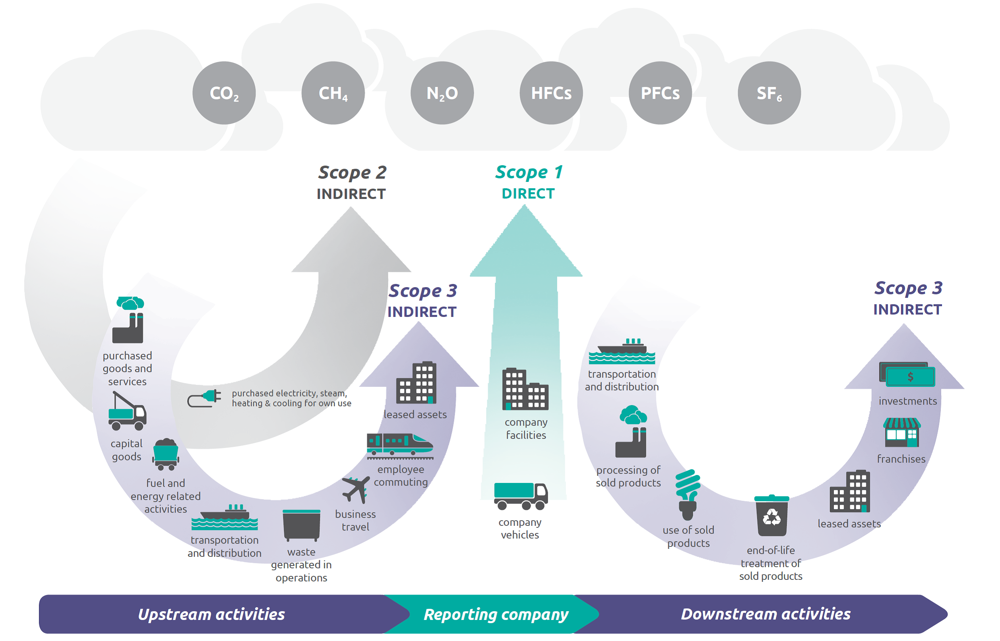
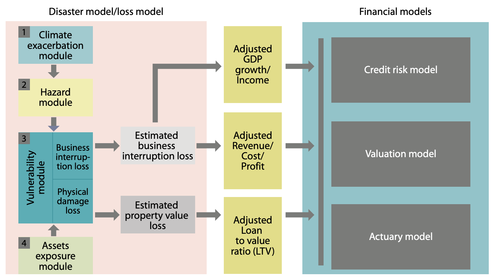
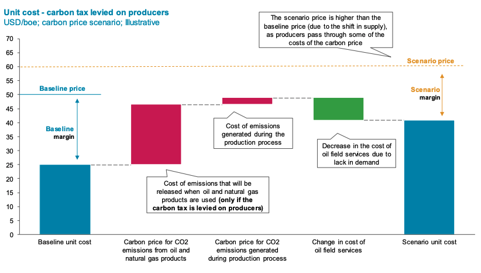
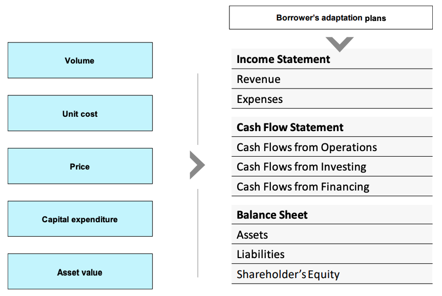

## Analyzing Investments

True story: I used to manage portfolios of mortgage backed securities.  These were very complex to analyze, because as interest rates changed, their rates of repayment changed.  As a result, their value relative to other bonds such as Treasuries would move differently as rates rose and fell.  

So we and other investors and traders used very complex models called "Option Adjusted Spread" or OAS models to evaluate them.  These models projected interest rates and then repayment rates of the mortgages for 30 years under thousands of different scenarios, then aggregated the scenarios to come up with values for securities in the present day.  The OAS models were calibrated to the market prices of treasury or interest rate swap rates and options, so that they, in effect, valued the mortgage backed securities against them.  This also allowed mortgages to be hedged with treasuries, swaps, and options, which is what mortgage hedge funds in fact did.  But since these OAS models all relied on models of prepayments based on historical analysis of the data, in effect these funds were making bets on the correctness of their prepayment models.

Then I met a Trader at a Big Firm.  This Big Firm had lots of analysts, including one of the best prepayment analysts on the Street.  But he just sat there by himself off to the side and kept sending us scatterplots that looked like this:

That's it???  It was a spreadsheet he maintained himself.  People thought of his scatterplots as something between a toy and a joke.  But first appearances are deceiving.  In fact, the Trader understood OAS models so well, he took it part to its basic components.  Then instead of putting it back the usual way, he opened it up and fitted it with market prices.  As he explained, "This is the market's OAS model.  I've got the history of the market and all those analysts with all their models to compare the current prices with.  That's better than any one person's model."   In this way, he was way ahead of the Wisdom of the Crowd talk.  This market-based model helped him identify mispricings and opportunities where big fancy models could not.  He went on to be _very_ successful.  

Today we're told that ESG or climate investing is hard because it's hard to get the data and hard to interpret them.  Hard to know which long-term scenario to use and how to 
analyze them.  But this is nothing new, and there is a way to get around these problems.  Let the market tell you.  There are hundreds, probably thousands, of smart people already looking at the climate risks of all sorts of 
traded investments such as stocks and futures.  You can piggy back on all the time and money they spent on data services, computer models, and research -- for free!  All you need is market prices, a computer, and some [models](https://github.com/opentaps/open-climate-investing) -- which we gave you for free!

There are some very successful investors who only trade with market implied models and do no fundamental research.
For most investors, though, this kind of market implied model is not the end, maybe not even the beginning of the end, but it is the end of the beginning.
It is a good way to quickly flag down opportunities, such as mispricings between securities and differences between the market's thinking and your fundamental analysis.
It is a great check on your analysis, those "Am I Sure?" moments that could save your career.  It is also the best way to make sure that a fund you're sold really does
what they said it would do.

### Market Implied Model

_"Come on pal.  Tell me something I __don't__ know.  It's my birthday.  Surprise me." - Gordon Gekko_

The problem with financial data and analysis is that if you know it, and I also know it, then it's not worth much.  You got to find something other people don't know yet.  

Long ago (up to the 1950's), investing meant sifting through financial statements, combing through the news wires, and scuttling about for every little "butt" of information about companies.  Then in the early 1960's, a young group of
finance professors revolutionized the field by saying none of that mattered.  In fact, it didn't even matter if you knew you were investing in livestock or preferred stock.  All that mattered was how the assets you owned
moved with the overall market.  That could be summarized in a simple statistic, called the _Beta_ or _factor loading_, which could be calculated as the relative  returns of an asset versus the returns of the market from a regression.  Once you had this Beta,
you could tell how risky an asset was, how two assets should move versus each other, and whether an asset returned enough to compensate for its risks.  

This revolutionary insight turned finance into a quantitative field.  Today few finance departments teach investing the way Ben Graham taught it to Warren Buffett.  The top traders at hedge funds are more likely to be 
physicists than accountants.  And though it is still vociferously denounced by the "stock pickers" in the industry, the truth is that this new way of thinking, called "Modern Portfolio Theory," works well in some important applications:

 * It's great for finding short-term mispricings and trade around them.  If two stocks are supposed to move together at a certain ratio with high probability, and one moves first, it's (usually) a good bet the other will move soon.
 * It's great for analyzing the performance of portfolios.  While the investment industry touts its stock picking prowess, most funds contain so many stocks, their returns could be reduced to statistical relationships versus major index returns.

The first model of Modern Portfolio Theory, called "Capital Asset Pricing Model" with the single Beta, was just the beginning.  Over time, researchers found other statistically significant factors in returns.  The [Fama French 3-factor model](https://rady.ucsd.edu/faculty/directory/valkanov/pub/classes/mfe/docs/fama_french_jfe_1993.pdf) from 1993 became popular because it added two more parameters, one for size and one for balance sheet leverage.  This was followed up by the [Carhart 4-factor model](https://doi.org/10.1111/j.1540-6261.1997.tb03808.x) from 1997, which introduced a fourth factor, momentum. Today there are ever more sophisticated factor models with ever more factors, such as the [MSCI BARRA Multi Factor Model](http://cslt.riit.tsinghua.edu.cn/mediawiki/images/4/47/MSCI-USE4-201109.pdf).

For analyzing climate risk, we started with multi-factor equity returns model such as Fama French and Carhart models, and added an additional factor for climate exposure.  The factors we are using are:

 * Market: Returns of the market over the riskfree rate, similar to the original Beta from CAPM 
 * SMB: Small Minus Big, the return difference of small cap stocks vs large cap stocks
 * HML: High Minus Low, the return difference of stocks with high book equity/market equity vs low book equity/market equity.  The stocks with high book equity/market equity are usually companies in financial distress (ie, banks where the market sees more credit losses than has been written down), while the stocks with low book equity/market equity are usually high-growth companies (ie, tech companies without much earnings.)
 * WML: Winners Minus Losers, the return difference of stocks with high momentum (winners) vs low momentum 
 * BMG: Brown Minus Green, the return difference of stocks with high climate risk (Brown) vs low climate risk (Green)
 
What this model does is explain the sensitivity of any asset (could be a stock or a fund, or even futures on commodities -- anything that is traded would work) based on the return differential of stocks with high carbon risk (Brown) vs
those with low carbon risk (Green).  With this model, we could now get the market's measure of the climate risk of a
stock by seeing how its prices have behaved.  In other words, what do all those smart people pouring through carbon disclosures, ESG data, and running scenarios, not to mention analyzing the company's business model, assets, and 
operations, really think?

Most importantly, we have turned all those disclosures, data, and scenarios -- the vague ESG stuff that make portfolio managers say "How do I monetize this?" (and traders say
"How the f@#! am I going to make money with this s#&!") -- into something you could trade with.  Furthermore, we've gotten around the commonly known problem of inconsistencies between ESG disclosures and scores by
using the market as the benchmark.   So using a market implied model, you don't have to bet on which ESG disclosure is "right."  You just have to be more right than what the market, as an aggregate, thinks.

All you have to know is which stocks are Brown and which are Green.

Using a BMG factor we developed from the return difference of the SPDR Series Trust - SPDR S&P Oil & Gas Exploration & Production ETF (XOP) as Brown stocks and the VanEck Vectors Low Carbon Energy ETF (SMOG) as the Green stocks, we developed a BMG series called the "XOP-SMOG ORTHO 1".  It was quite an adventure.  We wrote it up as a [research paper](https://papers.ssrn.com/sol3/papers.cfm?abstract_id=3967613).  Now let's see how it works like with an example. 

#### Analyzing Stocks and Funds

Let's look at a list of [7 Best Oil Stocks to Buy](https://money.usnews.com/investing/investing-101/slideshows/best-oil-stocks-to-buy) and [7 Renewable Energy Stocks and ETFs to Consider](https://money.usnews.com/investing/stock-market-news/slideshows/renewable-energy-stocks-to-consider), and see what the market tells us about them:

Look in the "BMG" column.  This is the market implied climate risk for these stocks.  What these numbers mean is that all else equal, for every 1% that the Brown stock XOP outperforms the Green stocks SMOG, ConocoPhillips (COP) will on average outperform by 0.55% and Marathon Petroleum (MPC) by 0.25%.  Conversely, when SMOG outperforms XOP by 1%, we could expect Vestas Wind Systems (VWDRY) on average to outperform by 0.48% and NextEra Energy (NEE) by 0.20%.  Note that these are average expected results -- The last column, R-squared, shows how well the model explains the returns of each stock.  The oil stocks are generally well explained by the model with R-squared of up to 0.87 for Schlumberger, while the renewable stocks much less so, with NextEra Energy at only 0.31.   

In general, the oil stocks have positive climate risk factor loadings, and the renewables have negative ones, and they're all statistically significant except for Albermarle which is greyed out.  This seems to show that the market is generally pricing the climate exposures of these energy companies in line with their oil versus renewables exposures.  Whether their relative amounts are correct, though, is another question.  Does Marathon Petroleum really have half the climate exposure of ConocoPhillips?  Is Vestas really that much more sustainable than the stocks in the Invesco Solar ETF?  

Or are there inefficiencies in how the market is analyzing the climate exposures of these companies.   

Having a measure climate risk like the BMG factor loading then allows us to compare companies' valuations versus their climate risk exposures.  This table shows that the companies with negative BMG factor loadings have much higher price to book ratios than the oil companies with positive BMG factor loadings:

If you're a visual person:

Even though they're across industries, the general message is clear.  The stock market values companies more when they have less climate exposure.

Alternatively, you could look at this table/chart as a place to start looking for opportunities.  Will some of the oil companies will be successful at reducing their climate exposure, so that in time their prices would rise as the market recognizes it?  Is Vestas Wind (VWDRY) so much better than the other NextEra Energy (NEE), and is it in turn so much better than First Solar (FSLR)? 

#### Analyzing Market Sectors

This is where we still have work to do.  In our [research paper](https://papers.ssrn.com/sol3/papers.cfm?abstract_id=3967613), we found that the XOP-SMOG ORTHO1 BMG series could explain the climate exposures of the Energy industry quite well, but really doesn't work outside of it.  Meanwhile other BMG series constructed from different ESG metrics could literally give you the opposite answers to the climate exposure of whole industries.  Depending on which one you used, you could believe that Auto Manufacturers, Utilities, Banks, and even Mining companies could either gain or lose from climate change.

What does this mean?  One of three things:

 * The market isn't pricing in climate risk in other industries, because it doesn't know how climate change will affect those industries.
 * The market doesn't have a consistent climate risk gauge across industries, because each industry has a different mix of transition and physical risk.
 * We haven't found the right way to capture the market's climate risk exposure in other industries.

We are continuing to work on this.  [Sign up](https://opentaps.org/subscribe/) to find out what we find.

### Fundamental Analysis

_"The most valuable commodity I know of is information" - Gordon Gekko_

I'm going to (figuratively) bet that given the limited awareness of climate among investors, the market is probably still missing a lot.  In other words, there are 
probably a lot of opportunities if you invested some time in analyzing companies' climate exposures.  Whereas the market implied model allowed you to cut out the whole issue of inconsistent data and disclosures, fundamental analysis is all about comparing different points and figuring out which one is actually right.  So let the market implied model be a starting point, and let's dig in.

Climate change is a long-term process with a lot of uncertainty.  How it plays out, and then how that affects an actual company, could depend on a number of scenarios.  Thus
analyzing climate exposure is, in many ways, similar to analyzing mortgage-backed securities:  You will need to project multiple scenarios far into the future, calculate their 
financial impacts, and then attach probabilities to the scenarios to arrive at their expected values today.  (Now you see why I needed to tell you about mortgages and OAS models.)

The key steps of this analysis are:

 * The company's current climate exposures: How much are its Greenhouse Gas (GHG) emissions now?  What are its assets?
 * How those exposures will change: Every company talks about "sustainability" these days.  What is it really doing to reduce its climate exposures or "decarbonize"?
 * Overlaying scenarios: How will potential events affect the company, given its current exposures and its path to decarbonize?
 * Valuing the scenarios: Under each scenario, what is the economic impact (positive or negative) to the company?
 * Comparing versus the market: Now the market implied values come in handy.

As you can see, climate investing is not as simple as divesting from oil companies.  Just like you wouldn't buy a stock based on its most recent earnings, you shouldn't just rely on 
current emissions to make climate investment decisions.  Instead, you have to account for both current positions, management actions, and potential long-term scenarios.  This is
what makes investing fun!

#### Data and Where to Get Them

The most basic data you will need is the emissions of a company.  While we usually talk about CO2 emissions, there are other gases that cause climate change and do a lot more damage.  According to the [EPA's Overview of Greenhouse Gases](https://www.epa.gov/ghgemissions/overview-greenhouse-gases), methane (CH4) is 25 times, nitrous oxides 300 times, and fluorinated gases 10,000 to 20,000 times more potent than CO2.  (Maybe that's why the agricultural chemicals, copper, and gold stocks
had such high carbon risk factors?)  All these gases are collectively called "Greenhouse Gases" (abbreviated "GHG"), and their emissions are converted to their CO2 equivalents, or "CO2e," based on these ratios.

Furthermore, companies emit GHG in a variety of activities.  The standard for GHG emissions reporting is the [GHG Protocol](https://ghgprotocol.org/), which breaks down a company's emissions into three scopes:

 * Scope 1 is emissions from fuel directly combusted on site at a company.  For example, utilities and steelmakers burning coal or natural gas, or airlines burning aviation fuel.
 * Scope 2 is emissions from energy purchased by a company.  For example, buildings purchasing electricity from a utility.
 * Scope 3 is emissions from all the upstream and downstream activities of a company.  It is a very broad category and includes all of the following and more:
    * Oil extracted by an oil company and burnt by an airline or car
    * Flights taken by employees of a company
    * Steel bought as raw materials
    * Shipping a product to customers
    * Using cloud-based servers (Yes, that includes your reading this article right now.)

_Source: [EPA Scope 3 Inventory Guidance](https://www.epa.gov/climateleadership/scope-3-inventory-guidance)_

Naturally, this means emissions are transferred between companies.  Natural gas that is extracted by an oil company is Scope 3 for the oil company, Scope 1 for the utility that uses it, and then Scope 2 for the office building that 
uses the electricity from the same utility.

Because Scope 3 emissions are so broad and tangled up and down the supply chain, they are the hardest to account for.  It is also what many climate investors analysts and ESG data providers are missing, and where some companies are 
deliberately trying to hide their climate exposures.  So be very careful about any analysis that does not include Scope 3 emissions.

So where do you get this information?  There are a lot of reporting standards out there, but let's take a look at a few common ones:

 * [CDP (Carbon Disclosure Project)](https://www.cdp.net/en) is a self-reported survey of carbon emissions and policies by companies.  Here is an example of [Adobe's response to CDP questionnaire](https://www.adobe.com/content/dam/cc/en/corporate-responsibility/pdfs/Adobe_CDP_Climate_Change_Questionnaire_2021.pdf).  The data they collect is available to paid subscribers.
 * Taskforce for Climate Finance Disclosure (TCFD) and Sustainable Accounting Standards Board (SASB) are general guidelines for reporting on climate and sustainability.  Take a look at the [TCFD disclosures](https://about.ups.com/content/dam/upsstories/assets/reporting/sustainability-2021/2020_UPS_TCFD_Report_081921.pdf) and [SASB disclosures](https://about.ups.com/content/dam/upsstories/assets/reporting/sustainability-2021/2020_UPS_SASB_Standards_Table_081921.pdf) for UPS as examples. 
 * [GRI](https://www.globalreporting.org/) is a more comprehensive set of sustainability reports, somewhere between the CDP's surveys and the disclosures of the TCFD and SASB.  Note [Adobe's Corporate Social Responsibility](https://www.adobe.com/content/dam/cc/en/corporate-responsibility/pdfs/Adobe-CSR-Report-2020.pdf) follows points from the GRI.  

Also note that some companies (Adobe) supply a third party audit letter, some companies (UPS) have their auditors review some of their disclosures, and others provide disclosures without any auditor backing.

Want to learn more about climate disclosures?  How about hear what it was like from somebody who actually made the disclosures?  See [Interview - CDP and Climate Disclosures: a Corporate Perspective](Interview-Climate-Disclosure-Corporate-Perspective.md).

#### Do Goals Matter?

Related to disclosures are organizations that help companies set climate goals.  They also provide helpful information about companies' climate exposures.  A few well known ones are:

 * [Science Based Target Initiative](https://sciencebasedtargets.org/) (SBTi) validates companies' climate targets against the Paris Agreement 1.5 degree goals.  They publish [standards for emissions reductions by industry](https://sciencebasedtargets.org/sectors), known as the [Sectoral Decarbonization Approach](https://sciencebasedtargets.org/sectors).  They publish a [list of companies taking action](https://sciencebasedtargets.org/companies-taking-action) under their emissions reduction targets.  There are currently 1750 companies with either approved targets or in the process (committed.)  
 * [Transition Pathway Initiative](https://www.transitionpathwayinitiative.org/) (TPI) assess management awareness of climate issues and carbon performance based on International Energy Agency (IEA) Energy Technology Perspectives report. 
 * [Climate Action 100+ Net Zero Benchmark](https://www.climateaction100.org/progress/net-zero-company-benchmark/) is focused on about 160 top emitting companies, relying in part on TPI data.  Their [2020 report](https://www.climateaction100.org/wp-content/uploads/2020/12/CA100-Progress-Report.pdf) has detailed information about the companies.

Importantly, note that these initiatives are very high level and do not actively monitor the companies' progress along their targets or commitments.  This is a big void in climate investing and an area we're working to address with an
open source [Investor Climate Disclosure Project](https://wiki.hyperledger.org/display/CASIG/Investor+Climate+Disclosures+Project).

Why do these targets matter?  Because they are a measure of a company's seriousness in addressing climate change.  While many companies now have departments who submit ESG surveys, few (only 5% to 25% of the S&P 500, for example) have committed
to meeting the goals of the Paris Agreement through SBTi or others.  Therefore, a commitment is by itself the sign of a climate leader.  (Follow through is something we as investors should hold the companies to.)  

Furthermore, if and when the world's economies follow their Paris Agreement's National Defined Contributions (NDC's), then the public policy and carbon task transition risks in those economies would probably follow the Paris Agreement goals.  Therefore, companies could be minimizing their risks by getting onboard with Paris Agreement goals early.  Time will tell, of course, but that's the point of the next part: Scenario analysis.

#### Scenario Analysis

In a [previous chapter](Climate-and-Investing.md) I went through the results of different analyses on the effects of climate change on investments.  Now let's take a closer look at how the analyses were done, so that we could perform similar analyses for our investments.  Analyzing the effects of climate is a multi-step process which involves projecting several key variables into the future:

 * Trajectory of Greenhouse Gas (GHG) emissions based on current trends
 * Effect of GHG emissions on changing the climate, both locally and globally
 * Physical effect of those climate changes, such as droughts or hurricanes   
 * Financial impact of those physical effects
 * Mitigation measures, such as the various policies to reduce emissions and "decarbonize"
 * Adaptation measures against the risks, including hardening infrastructure and reducing emissions

Physical risks are calculated by mapping assets, such as buildings or plants, and then running models for hazards such as hurricanes, flooding, and fires on the assets.  The models would project physical damage, which would then need to be converted into financial losses to calculate the additional expected loss due to climate risks and identify portfolio vulnerabilities.  There are both commercial models such as ClimateWise and FourTwentySeven and open source models such as [CLIMADA](https://github.com/CLIMADA-project/climada_python) that could be used. 

_Source: [NGFS Overview of Environmental Risk Analysis by Financial Institutions](https://www.ngfs.net/sites/default/files/medias/documents/overview_of_environmental_risk_analysis_by_financial_institutions.pdf)

Transition risk requires a process of mapping changes in regulations and consumer demand on companies' financial results.  Typically, these scenario analyses incorporate changes in energy mix and technologies, such as switching from fossil fuels to renewables and electric vehicles.  They also incorporate carbon taxes, which are calculated against the companies' projected GHG emissions.  For example, here is an example from chapter 4 of the [NGFS Case Studies book](https://www.ngfs.net/sites/default/files/medias/documents/case_studies_of_environmental_risk_analysis_methodologies.pdf), where Oliver Wyman shows a calculation of the impact of carbon taxes on oil and gas exploration:

_Source: NGFS and Oliver Wyman_

This could then be extended into the financial results, as in this example from "Climate Credit Analytics: Model Documentation" by S&P and Oliver Wyman:

  
_Source: NGFS and Oliver Wyman_

Some useful resources for constructing your scenarios:

 * [NGFS Climate Scenarios for central banks and supervisors](https://www.ngfs.net/sites/default/files/media/2021/08/27/ngfs_climate_scenarios_phase2_june2021.pdf) is the most up to date (2021) and best resource.  It covers a wide range of scenarios that span orderly transition to 1.5C, current trend to 3C, and sudden transitions after 2030 to reach 1.8C.  The carbon prices in these scenarios reach an amazing $800/ton in some cases.
 * [TCFD The Use of Scenario Analysis in Disclosure of Climate-Related Risks and Opportunities](https://assets.bbhub.io/company/sites/60/2020/10/FINAL-TCFD-Technical-Supplement-062917.pdf) is a bit old, from 2017, but it describes in detail different scenarios from the IEA and a few others.  These scenarios show the increased need for biofuels, renewables, and nuclear energy, as well as carbon prices going up to $140/ton to $210/ton under some scenarios.
 * [SBTi Sectoral Decarbonization Approach (SDA)](https://sciencebasedtargets.org/resources/files/Sectoral-Decarbonization-Approach-Report.pdf)	breaks down the path of emissions reduction necessary to reach 2C by industry, such as steel, cement, power generation.  A more updated version for reaching 1.5C target is in the works.  For companies which are committed to SBTI targets, this could be useful in constructing their path of future emissions.    
 * [CarbonBrief's Explainer: The high-emissions ‘RCP8.5’ global warming scenario](https://www.carbonbrief.org/explainer-the-high-emissions-rcp8-5-global-warming-scenario) describes what the "Representative Concentration Pathways" are, how they were derived at, and why the RCP8.5 scenario that is often cited "Business as Usual" may be too severe.  (Some good news finally?)

Now let's look at how to do the scenario analysis.

For all companies, transition risk is an important concern.  Start with the current emissions and factor in futures emissions paths, using the SBTI targets if the company is committed or other scenarios for the industry if it is not.  Then calculate the cost of the emissions with carbon price scenarios, and add that to the company's costs.  Assume some rate of pass-through to the customers and add that to the revenues.  From this, you could derive the change in net income from a climate scenario.   

For companies which are very location-specific, such as those with a lot of real estate, facilities, or agricultural land, physical risk is also a concern.  Look at the location of the companies' assets and overlay the impact of weather.  From that, figure out the potential for loss, and back out an expected loss.  This should be a proxy for the insurance costs for carrying those assets and added to the company's costs.

For companies which are very energy-intensive, different analyses are required.  Energy producers, such as oil and gas companies, are sensitive primarily to shifts in demand, part of which would be reflected in carbon prices.  Energy users, such as power generation utilities and materials (mining and steelmakers), may have to make heavy capital investments to shift their energy mix.  Here, you would have to look beyond financial analysis and think about both the management's plans and how the financial markets will accommodate them.  For example, the steel industry requires capital investment decisions made decades in advance.  Is the management investing in the right technologies, or will carbon pricing makes its products uncompetitive?  Could the company raise the money to invest in those technologies?  In other industries, ask questions like "What is the management of an oil and gas company planning to do with its proven reserves?"  "Does an oil exploration company have alternative business models?"  All these questions would lead to comprehensive adjustments to balance sheets and income statements.

Finally, in all cases, use some common sense to think through second order effects.  Maybe you're invested in a restaurant chain that doesn't have physical locations.  But how will the consumer shift to vegetarian diets affect business?  Is it situated in storm sensitive areas?  Or maybe you're invested in an automobile manufacturer.  How well could it shift to electric vehicles and on-demand transportation?  Even without precise scenarios, you can use some rough, back of the envelope calculations to come up with the potential impact on a company's business results.

It's not enough to run through a single scenario, even if it's a "worst case" scenario.  That's probably just something you'd run once a year for the risk auditors, management, or regulators and then put in a drawer somewhere.  To really understand your portfolio, run it through a range of scenarios.  Pick some reasonable values for the variables--flood levels, carbon prices, demand shifts, additional CapEx required--and see which of those a company is most sensitive to.  Attach probabilities to the scenarios.  Even some rough probabilities for probable (50%), possible (20%), extreme (5%) would help put a number on the risks.  

Now you'll have a number for climate cost that would allow comparing different investments to each other.

### Putting it All Together

_"In the short run, the market is a voting machine but in the long run, it is a weighing machine." - Ben Graham_

In the end, investments converge on fundamentals: Bonds are either repaid, or they default.  Stocks are ownership in businesses, which either make or lose money.  Any investment model must be rooted in the fundamentals of the assets you invest in, or they will lead you astray.  Either you will lose money, or worse, lead a career full of sound of fury, but ultimately signifying nothing.

The goal of climate investing is to pick the companies that are really reducing their exposures to climate change, and in the process encourage all companies to do the same.  Therefore, it must be rooted in sound fundamental analysis about companies' real emissions and their strategies to reduce them.  

But fundamental analysis is hard, because it involves forecasting the future.  Many investors have also gone astray believing in their analysis all the way to the bankruptcy court.  And if we get climate investing wrong, it's the whole financial system that would be headed that way.

So the market implied models could help us as a sanity check.  Are we sure what we're right?  Or does everybody else know something we don't?  It is the yin to the yang of fundamental research.

It could also help you make some money finding mispricings in the market, which is always a nice thing.

#### Get Updates

[Sign up](https://opentaps.org/subscribe) for our email newsletter to get updates on this book and the [Open Climate Investing project](https://github.com/opentaps/open-climate-investing).

#### Disclaimer

_This content is published for informational purposes only and not investment advice or inducement or advertising to purchase or sell any security.  See [full disclaimer](Disclaimer.md)._
