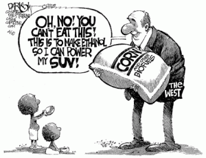
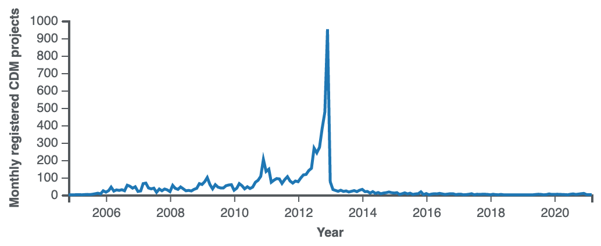
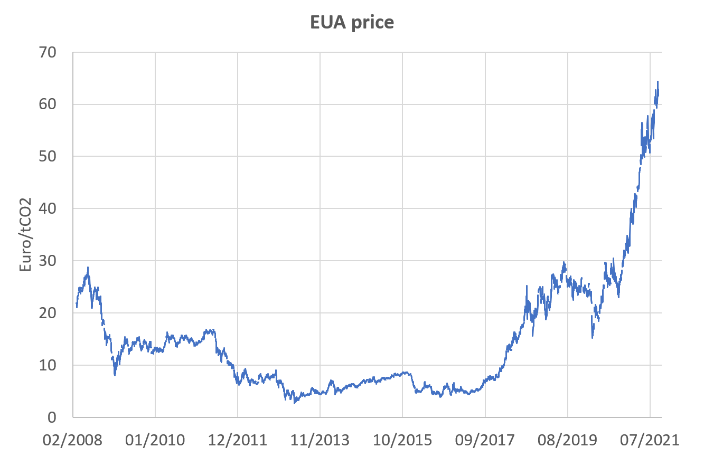
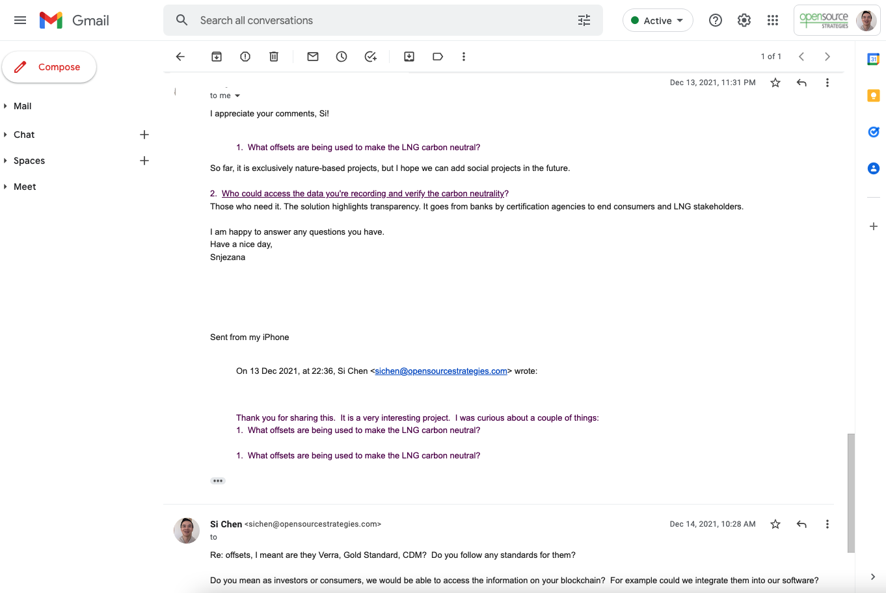
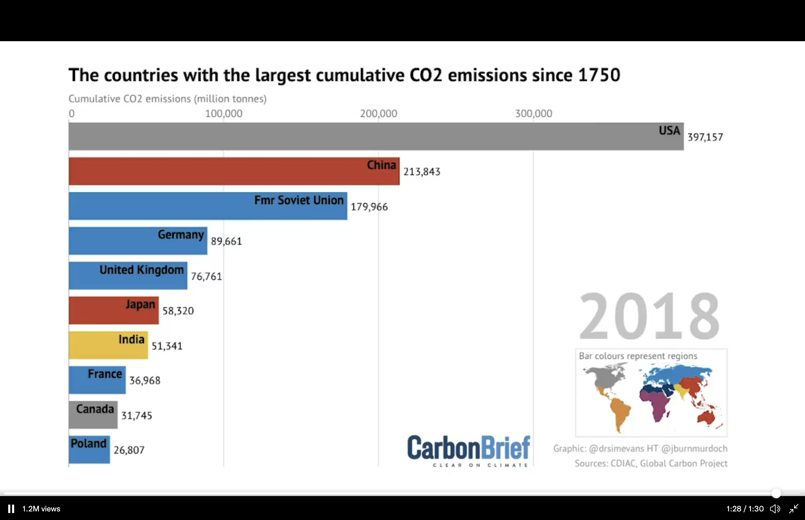
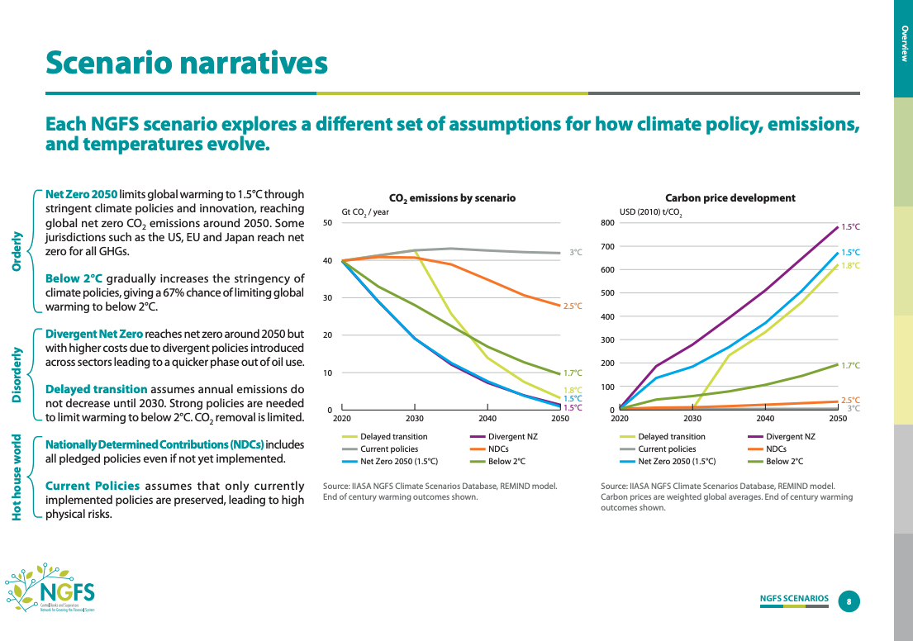

# Carbon as an Asset

Ever wonder who would play you in a movie?

Unfortunately, Hollywood has been unkind to the financial whiz these days.  Just look at Mr. Big.  If finance is what you do, then you're a big short.

But what if you were actually using finance to save the world?  What if, instead of financing shopping malls, you financed wildlife habitats?  Instead of structuring buyouts, you structured deals to fix climate change?

A [recent report from McKinsey](https://www.mckinsey.com/~/media/mckinsey/business%20functions/sustainability/our%20insights/putting%20carbon%20markets%20to%20work%20on%20the%20path%20to%20net%20zero/putting-carbon-markets-to-work-on-the-path-to-net-zero.pdf) says that this might even be possible.  This chart alone is already enough for some venture capitalists to open their wallets.  We might one day call it "the chart that launched a thousand startups":

But is it real?  

Part of it depends on what "Commitments" means.  Are they commitments to buy voluntary carbon offsets?  Net zero commitments from companies which could be fulfilled by voluntary carbon offsets or by compliance carbon credits?  Commitments which must be fulfilled by voluntary carbon offsets because alternative decarbonization options are not available?  [I've asked McKinsey](https://twitter.com/opentaps/status/1494439046327668737)--hopefully they'll write back and let us know.

Meanwhile let's look at what kind of an asset carbon _might_ be, and what it _might not_ be.  Note this chapter is about project investing, not venture capital investing: We're not going to talk about how to evaluate novel technologies, but rather investing in the output of those technologies.  

## What are Carbon Assets?

With sustainability and green being slapped on every old thing these days, let's first narrow down what a carbon asset is.

For our purposes, let's define a __Carbon Asset__ as a quantified, exclusive, and unused traceable claims of climate benefit, such as a reduction or removal of Greenhouse Gas (GHG) emissions.  This means to be considered a carbon asset, it must be:
- a Climate Benefit: While Social Development Goals (SDG's) and biodiversity are important, there are a lot of compliance carbon markets that don't require any other attributes.  To be consistent, then, we should restrict ourselves to just the climate aspect of these.
- Quantified: It must be quantified in units such as tons of CO2 equivalents.  This would exclude all sorts of activities, products, and services which may be better for the environment but which do not have a specific measurement of climate benefit and therefore cannot be valued or traded.  
- Exclusive: This is a requirement for being an asset.  While a climate positive activity benefits all of us, it could only be considered an asset if only one party could claim it against their account of Greenhouse Gas (GHG) emissions.  You can own it collectively as a shareholder, or the government can claim it as state property, but being an asset means somebody owns it while others do not, so that it can be valued and traded.
- Unused: This claim must not have already been used in anyone's emissions account.  If a carbon credit has already been retired, than it has been consumed and is no longer an asset.
- Tradeable: Finally, this means a claim which could be bought, sold, or traded for other assets, rather than a climate claim which is an attribute of another asset but could not be separated from it.  For example, the LEED certification of a building could be an "asset" to the building, but it is not an asset that could be separated from the building and traded on its own.

While most carbon assets today are verified by an external auditor, this may not always be a firm requirement.  For example, utilities' energy efficiency programs are often based on model or calculated energy savings, rather than actual data.  Two out of four options (A and B) of the [International Performance Measurement and Verification Protocol (IPMVP)](https://www.nrel.gov/docs/fy02osti/31505.pdf) allow energy savings to be calculated based on model data (A) or model plus some instrument readings (B).  If cities or utility regulators were to institute a compliance carbon credit program that included utility energy efficiency programs, then those carbon credits would probably not require verification.

__Investing in a carbon asset__ is then the exchange of money for a stream of carbon assets.  It could be the purchase of equipment to reduce or remove emissions from the atmosphere, to plant new trees or restore a forest, and, as you'll see, lots of other activities.  

A carbon asset could have a lifecycle that involves many activities, such as capture, transport, and storage of the GHG emissions.  The buyer of the carbon asset pays for "permanent" removal or reduction of GHG emissions, and the payments are split between the activities of the carbon lifecycle.

Carbon assets are usually thought of as credits, since they could be used as a credit against your GHG emissions or your tax bill from those emissions.  For the rest of this chapter, we'll use "carbon asset" and "carbon credit" interchangeably.

## How do Carbon Markets Work?

There are three major kinds of markets for carbon credits: voluntary, compliance, and industry.  Voluntary carbon credits are certified by entities such as The Gold Standard, VERRA, Plan Vivo, Climate Action Reserve, and Global Carbon Council, among others.  They establish methodologies and certification processes, review projects, and issue the credits.  The keyword here is "voluntary": The offsets are not required by any regulatory entity, and so they are for use as you'd like.  Concerned about the climate impact of your wedding or trip to space?  Buy some offsets and retire them in your name.  Want to tell your customers you're a sustainable brand?  Buy some offsets and put it on your website.  The great thing about voluntary offsets is that they support a large set of potential project types, developers, and users all over the world (see [our paper](https://papers.ssrn.com/sol3/papers.cfm?abstract_id=3981914) for a breakdown of the market.)  The downside is that the market is very small (it just recently surpassed $1 billion in __annual__ volume) and the prices low.  

The compliance market is the opposite.  They are run by government agencies, usually as part of cap and trade emissions reductions programs, and companies are required to buy credits when their emissions are over the allowed amounts.  As government programs usually go, they are politically negotiated, target only the largest companies in key sectors, allow only certain types of emissions reduction or removal projects, and have rules and enforcements that may seem arbitrary to anybody outside the bureaucracy.  The best example is the European Union's Emissions Trading Scheme (ETS), which is a GHG emissions cap and trade program in all 27 EU countries plus Liechtenstein and Norway.   It covers major GHG emissions sectors including electricity and heat generation, heavy industrial manufacturing, and commercial aviation, for a total of about 40% of total emissions in the EU.  At $200 billion per year, it is the largest carbon market in the world.  But it is not the only one.  China launched its emissions program in 2021, focusing initially only the power generation sector and using emissions intensity rather than absolute emissions as its metric.  A bevy of other national, state, and regional compliance carbon markets such as California Air Resource Board's cap and trade program exist all over the world.  As a result, the price of carbon varies widely from country to country:

Finally, some industries are organizing carbon markets of their own.  The best example is the Carbon Offsetting and Reduction Scheme for International Aviation (CORSIA), a consortium organized by the UN's International Civil Aviation Organization (ICAO).  CORSIA covers international flights of most major international airlines (except India and China) and mandates measurement of total emissions, reducing emissions through efficiency improvements, and offsetting.  It publishes a [list of eligible voluntary carbon credits](https://www.icao.int/environmental-protection/CORSIA/Pages/CORSIA-Emissions-Units.aspx) that could be used.  A key motivation for CORSIA was that international flights did not fall into any particular country's emissions account and therefore their Paris Agreement obligations.   Since many supply chains also span multiple countries, other industries may follow suit with carbon markets as multinationals try to manage their emissions and climate risks.   

A subtle but important difference between voluntary offsets and compliance carbon credits: Voluntary offsets are based on the concept of additional emissions reductions or removals.  To be a valid offset, the project must've not been possible without funding from the offsets, and the amount of offsets issued must be additional to a business-as-usual baseline.  Compliance credits are based on actual emissions versus either an absolute amount cap or an amount calculated from output multiplied by the carbon intensity of production.  You pay if you're above your cap.  It's that simple (well, no, nothing with a government regulator is ever simple, but ...)   As a result, for example, renewable energy projects may not qualify as valid voluntary carbon offsets because the low cost of wind and solar have made them the most economical choice, but they would qualify for compliance credits if they lower your regulatory emissions account.

## Investing in Carbon Assets

_It's easy to do the math but hard to do the work. - Anonymous_

With the basics out of the way, let's look at investing in a carbon asset project.  Remember when you invest, you're handing out cash for a promised stream of future claims denominated in units of CO2e emissions, then looking to sell those claims for cash again.  Every step of the way involves uncertainty.  Except the part with you handing out the cash.

### Promises, Promises, Promises

_This is very basic stuff.  Feel free to skip this part if you've ever tried to collect on a bad loan._

The first thing you should think about is whether the investment is debt or equity.  Debt is a loan.  Equity is ownership.  Debt has promised regular payments, but no upside above them.  The other party just has to make those payments to you.  Equity investments have no promised regular payments, but all the upside.  You own it!  As long as it keeps producing income, it should be all yours.  The flip side is that debt must be paid back before equity investors get anything, so if things don't go well, their claims take precedence before the equity investors.  

Or so in theory.

The reality is, when you're ready to write the check, everybody promises you all sorts of protection.  But when the borrowers don't pay, the lenders are always the bad guys.  (Trust me -- I was a mortgage portfolio manager.)

For example, let's say your investment is a loan backed by solar panels.  In theory, if you don't get paid, you could get the solar panels back to install at another customer's site or just sell them.  In reality, could you really turn off a customer's electricity, then go and physically remove the panels?  Or would doing so violate public safety and threaten basic livelihoods?  Or simply be so expensive legally as not to be worthwhile?  If so, then even though your loan is theoretically secured by a hard asset (solar panels), in reality it's not -- it's just another unsecured loan backed by a signature.

Or, let's say your investment is a solar or wind farm where a local utility buys the energy from you.  Then the utility goes bankrupt and stops paying.  Would the local government make you pay for the operations and maintenance expenses to keep the power on, while the courts figure out how much you'll get paid, and when you'll get it?  

Finally, debt often relies on the kindness of strangers.  You'll need them to make a new loan at a later date so you could get paid back.  We call this "rollover" risk.  It happens because the projects themselves are very long-term, but term-matched funding is either not available, or borrowing for shorter terms is just less expensive.  Will those kind strangers always be there?  If it's an established asset class with a long history of financings, most likely.  If not, who knows?

Moral of the story: Don't let promises lull you into a false sense of safety.

### Technology Risk

OK, I lied.  Even though this chapter is not about venture capital investing, you're still going to have to evaluate some novel technologies.

The fact is, our understanding climate and nature are relatively immature and changing.  We've been burning large amounts of coal since the 1700's, but it wasn't until the 1960's that scientists started to realize what that could do (ie, cause climate change.)  Sixty years later, we're still learning.  This means that our attempts to capture or manage GHG emissions is just today's best estimate.  How well each of the following would actually work as the climate itself is changing remains to be seen: 

- Solar: Could a warming planet cause more cloudy days and reduce the output from solar panels? ([Princeton](https://www.princeton.edu/news/2020/10/07/climate-change-could-mean-fewer-sunny-days-hot-regions-banking-solar-power))
- Wind: How would climate change affect the amount of wind available for wind power? ([Harvard](https://www.seas.harvard.edu/news/2021/03/less-wind-due-climate-change-wont-impact-wind-power-generation-india-and-china), [Nature](https://www.nature.com/articles/s43017-020-0101-7))
- Hydropower: Do hydropower projects actually contribute to climate change by releasing methane?  ([Science.org](https://www.science.org/content/article/hundreds-new-dams-could-mean-trouble-our-climate), [TheGuardian](https://www.theguardian.com/global-development/2016/nov/14/hydroelectric-dams-emit-billion-tonnes-greenhouse-gas-methane-study-climate-change))
- Mangrove forests: Will mangrove forests survive climate change and the related storms? (See [TheConversation](https://theconversation.com/extreme-weather-likely-behind-worst-recorded-mangrove-dieback-in-northern-australia-71880), [NPR](https://www.npr.org/2020/09/11/912045029/climate-change-may-wipe-out-large-mangrove-forests-new-research-suggests), [NASA](https://svs.gsfc.nasa.gov/13885))
- Forestry: How much do forests really help cool the climate? ([Nature](https://www.nature.com/articles/d41586-019-00122-z)  As the planet warms, would terrestrial forests release more carbon than they absorb?  ([InsideClimateNews](https://insideclimatenews.org/news/13012021/forests-heat-climate-change/))  Is this already happening in the Amazonia? ([Nature](https://www.nature.com/articles/s41586-021-03629-6), [LiveScience](https://www.livescience.com/amazon-rainforest-accelerate-climate-change.html))
- Soil carbon: Could we actually be wrong about whether soil really sequesters carbon, or how much or how permanent the sequestration is?  ([Quanta](https://www.quantamagazine.org/a-soil-science-revolution-upends-plans-to-fight-climate-change-20210727/), [Nature](https://www.nature.com/articles/s41586-021-03306-8.epdf))

### Regulatory Risk

Or does it really matter?

The answer is it depends.  

Concerns about the quality of the credits eventually drive the prices, but in different ways.  In the voluntary offsets market, participants react like in most markets -- If bad news pile up, prices fall (remembering that it is a very small and fractured market.)  For example, renewable energy projects have traded to less than $1 per ton CO2e because participants no longer believe they are additional.  The problem with voluntary carbon offsets is that the market is traded over the counter and fairly illiquid, so you may not have a chance to adjust your position in time.  In compliance markets, the regulators may change the rules after criticism, such as [concerns about too many free credits under the EU ETS](https://www.eca.europa.eu/en/Pages/DocItem.aspx?did=54392) leading to [potential rule changes](https://www.euractiv.com/section/emissions-trading-scheme/news/leaked-the-eus-carbon-market-reform-proposal/).  This is a slow, political process similar to rezoning.  If the market is driven by end user compliance demand rather than trading, then there would probably be time to react.  But when the change happens, as it did with the CDM (see below), the effect could be dramatic. 

Meanwhile, remember that carbon assets directly affect critical parts of the economy, such as food, water, and energy.  So whether you think climate change is the most important challenge of our lifetime or free enterprise is the pillar of a free society, jobs and livelihoods will usually take precedence.  Therefore, carbon markets will always be highly controlled by governments, and your investments will always live under the shadow of that control.   

For example, climate activists and investors may both want higher carbon prices.  But most industries view carbon cap and trade, and therefore the need to buy carbon credits, as a tax.  Therefore, even if they're willing to participate and pay that tax for the long-term good of the society and their business, they will not accept outsiders driving up the prices of carbon credits for financial gain.  Everybody hates speculators whose greed cause unemployment, higher heating bills for the elderly, or losses for small businesses.  The runup in EU ETS carbon credit prices has already provoked a backlash: [Poland, Spain, and Czechia are protesting](https://www.euractiv.com/section/emissions-trading-scheme/news/europes-energy-price-hike-fuelled-by-speculators-spain-and-poland-say/) that financial players are driving up the cost of electricity and must be barred from the market.  [Poland and Czechia have even called for suspension of the ETS.](https://www.euractiv.com/section/politics/short_news/czech-minister-would-support-polands-call-for-suspension-of-eu-ets/)  

Or consider changes in land use due to production of sustainable biofuels or forestry carbon offsets.  Maybe good for climate, but if it happens at the expense of land for food production, expect backlash like this:

It probably wouldn't help much to say that the land was in fact being used for a forestry project, which then offset the emissions of your SUV.

## An Asset to Your Country

Let's say you've funded a project.  They go to file for a permit or tax credit.  They're routed to the environment ministry or agency.  The helpful official reads through the project description and says "This is great!  This is exactly what our country and the world needs.  You're approved!"  They enter your project into their carbon registry, which is the connected to all the other carbon registries in the world through a system like the [World Bank Climate Warehouse](https://www.theclimatewarehouse.org/about).  

Guess what?  Your carbon credits have just been nationalized.  They really became an asset to their country.

How is this possible?  In just about every country, you need a permit for land use change or energy projects, which also requires environmental review.  Many countries also offer conservation tax credits, which could help pay for carbon projects but also require official review and registration.  Meanwhile, the Paris Agreement has specified that each national government will make National Defined Contributions (NDC's) on climate change.  Countries which exceed their NDC goals could trade the excess to another country under Internationally Transferred Mitigation Outcomes (ITMO's.)  These are country-to-country transfers under bilateral trade agreements.([Source](https://www.ndcs.undp.org/content/dam/LECB/docs/pubs-tools-facts/undp-ndcsp-faqs-itmo-article6.pdf?download))

Some countries will need to claim every bit of climate action to meet their NDC's.  Other countries may view the ITMO's are a source of ready money if they could exceed their NDC's.   Brazil surprised the world by supporting international carbon markets under Article 6 at COP26 in Glasgow.  Now it's planning to become a [major exporter of carbon credits](https://www.iccbrasil.org/cop26-icc-brasil-launches-the-english-version-of-report-opportunities-for-brazil-in-carbon-markets/) of up to $100 billion by 2030.   

### The Other Usual Risks

At the risk of becoming a prospectus filled with pages of warnings nobody seems to read, here are the usual risks of any project finance deals you _should_ be aware of:

Term matching: Are the prices for the carbon assets locked in for the life of your project, or will you get the market price over time?  If the latter, how will it change?

Market risk: During the pilot phase, there are philanthropic funders who will pay to help new technologies get off the ground.  But to scale up for mass adoption, the technology will have to tap into the next tier of buyers, who may not be so generous.  For example, today people are willing to $200 or more per ton for pilots of direct air capture.  People are also willing to pay up for nature-based solutions with a lot of co-benefits for the local communities.  But both are small.  If these projects are going to scale up, they'll have to tap into compliance markets, where carbon is just carbon.  They'll have to be priced competitively versus the cheapest credits available in those markets--and those could be very cheap (see below.)

Obsolescence risk: This is the opposite to market risk.  Certain types of carbon credits have fallen out of favor and lost value over time.  For example, renewable energy was a dominant part of the market, but the falling prices of renewables have made carbon credits unnecessary for supporting them.  As a result, existing carbon credits from projects issued years ago have fallen in value.  Are they any less valid now that new renewable energy projects are no longer eligible for carbon credits?  Technically, no -- the contracts are valid for the term of the credits.  But that's small consolation if your credits are falling in value.

Currency risk: In case the project is in another country.

Liquidity risk: If these are long term projects, will you be able to sell your interest in the project if you need the money for something else?  If you are planning to finance them, how will your lender appraise your project?  Could there be additional capital requirements from your lender?

Counterparty risk: How likely are the project developers to develop the promised carbon assets?  How likely are the buyers to purchase the carbon assets they've promised to buy?  What happens if either side fails to do as promised?

Basis risk: If you're thinking about using carbon assets to hedge your stocks' climate risk, don't.  There is no correlation -- for example, [our paper](https://papers.ssrn.com/sol3/papers.cfm?abstract_id=3967613) found no correlation between the European Union Allowances (EUA) futures for GHG emissions rights and the stock market.

## How Carbon Markets _Really_ Work

Now comes the million (billion?) dollar question: What will your credits be worth?  To help answer that, let's take a look at how some major carbon markets have played out over time.

### Renewable Energy 

First the success story.

Renewable energy, such as wind and solar, have been around for a long time.  Medieval windmills dot the scenic Low Countries of Europe, while NASA's Skylab featured prominent solar panels back in the 1970's.  Neither was a significant source of energy, though, until the oil crisis of the 1970's followed by the environmental concerns about burning coal and then climate change prompted major government investment in R&D and policies such as the Renewable Portfolio Standards (RPS).  Together they created a boom in demand for renewable energy which led to manufacturing efficiencies and falling costs.  From 2009 to 2019, the cost of solar energy declined an astonishing 89%:

This now makes solar and wind the least expensive sources of energy available (when the sun shines and the wind blows, that is.  Storage for the rest of the time remains a big technological hurdle.)  

So what happened to carbon assets based on renewable energy?

In the 2000's, when renewable energy was expensive, they were purchased as part of government mandated programs such as the RPS.  Buyers supported the market by entering into long-term offtaker agreements at premium prices.  Meanwhile, two types of virtual certificates were available to help funnel investment in renewable energy.  One was the Energy Attribute Certificate (EAC's), also known as Renewable Energy Certificates (REC's) in the US.  EAC/REC's simply attested that energy was generated from renewable sources, and they transferred the renewable or green attribute of a commodity, electricity, to buyers who needed that attribute.  They were mostly bought by utilities to meet their RPS mandates.  Through EAC/REC's, buyers who were willing to pay the green premium for renewable energy were essentially pooling their purchases to reach the amounts required for actual plants and facilities.

The other virtual mechanism was carbon offsets, which is a more direct carbon asset based on the emissions reduction of renewable energy versus standard grid electricity.  The [Clean Development Mechanism's ACM0002 methodology](https://cdm.unfccc.int/methodologies/DB/XP2LKUSA61DKUQC0PIWPGWDN8ED5PG) was adopted by the voluntary carbon offsets standards organizations such as Verra and Gold Standard to issue carbon offsets based on renewable energy.  A key requirement was that renewable energy projects would not be economically viable on their own, so carbon offsets were "additional" in their emissions reduction.

By mid decade of 2010's, the prices of renewable energy had fallen so much that they were in fact economically viable, but carbon offsets could still be issued based on the rules of the time.  As a result, they were basically free money for project developers, and there was a boom in renewable energy-based offsets.  They became the dominant sector of carbon offsets.  Prices fell as a result of supply and as buyers began to recognize that the projects were not truly additional any more, falling to as low as $1 per ton CO2e by 2021.

Finally in 2021 the Verra and Gold Standard both revised their rules to exclude grid-connected renewable energy projects from their carbon offsets standards.  They now require projects to be either non-grid connected or to be in very low income countries.  However, other standards will still certify these types of projects, and therefore they are still issued and accepted into programs such as CORSIA.  This has held down the general price of voluntary carbon offsets, since cheap large scale renewable energy projects are a plentiful source of "cheapest to deliver" offsets.

There was a similar fall in the prices of EAC/REC's, as plentiful renewable generation during peak hours led to a flood of certificates being issued.  While some RPS programs still accept them, others are tightening up to require that the certificates be matched to the time and grid location of generation, so that they actually account for energy at a time that was needed.  Initiatives such as [Google's 24/7 Carbon Free Energy](https://sustainability.google/progress/energy/) and [EnergyTag](https://www.energytag.org/) are examples of how the industry is becoming more sophisticated in its use of EAC/REC's.    

Finally, the renewable energy as a sector continues to grow, but because they are now an economically competitive asset, the market is also changing.  As renewable energy goes from being the most expensive to the least expensive source of energy, project owners could now afford to take the risks of owning the assets and supplying energy at whatever prices the market will bear, knowing that they have a cost advantage versus the alternatives.  The industry is starting to shift to "merchant power agreements," where project owners are selling energy on shorter contracts or even at spot prices.  

So what can we learn from this little history lesson?

- Offsets were a "bridge" measure for projects while they are not economically viable on their own.  If the technology scales successfully, then offsets will need to go away.  If the technology does not scale successfully, then well...
- Attribute certificates will always be around to differentiate green commodities.  As green commodities saturate some parts of the market, the market will become more sophisticated over time and try to find the remaining parts where green commodities are still scarce and valuable.  This will lead to ever more complex attributes certificates to help find those green commodities.
- While new technologies or project types could find support in the voluntary markets, which offer a greater variety and more flexibility, compliance markets are much, much bigger and will provide the scale.
- Both voluntary and compliance programs are slow to move, creating long windows of opportunities.
- In the early days, there will be advantageous terms and high prices paid for new projects, thanks to government policies and general goodwill.  To scale, though, prices for carbon assets must come down significantly to be competitive.  
- Because of this, new and novel technologies could try to get premium prices based on differentiation, but large scale technologies will need to trade as commodities where "a ton of carbon is a ton of carbon."

### The Clean Development Mechanism

Now the most famous failure of carbon markets.

In 1997, negotiations for the Kyoto Protocol at COP3 were not [going well](https://www.brookings.edu/research/salvaging-the-kyoto-climate-change-negotiations/).  The EU wanted aggressive emissions reductions targets.  The US was tentative on even moderate emissions reductions targets.  The developing countries wanted no restrictions on their economic development.  

So the Clean Development Mechanism (CDM) was created to at least start taking steps to reduce emissions.  The EU and Japan committed to reducing emissions (the US never did sign on) but would allow companies to purchase credits from developing countries to meet their targets.  It was supposed to be a win-win that provided development capital for green projects in developing countries while lowering the cost for companies in developed economies.

For a while it worked.  During the first commitment period of the CDM (2008 to 2012), 6,600 projects were registered under the CDM for 1.2 billion tons of CO2 equivalent credits, called "certified emissions reductions" or CER's.  A small amount but respectable.  Meanwhile prices were as high as 25 Euros per ton CO2e in 2008 and eventually settled to around 10 Euros per ton by 2012.

Then EU abandoned the CDM, and the market crashed.  In 2012, the EU voted to no longer accept CDM credits in its emissions trading scheme.  Prices for CDM credits fell to 0.50 Euros per ton.  There was a rush to register new projects before the EU's deadline for accepting for CDM credits, and afterwards volume dropped to practically nothing:

[As one CDM Executive Board member recalled](https://voxeu.org/article/collapse-clean-development-mechanism):

_The atmosphere at the first meeting of the CDM Executive Board in 2013 was combative as if it were a gathering of distressed creditors of a failed company. Executives from developing countries directed harsh criticisms at the EU and Japan. ... Although we avoided using the term ‘liquidation’ as requested by executives representing developing countries, the board decided to go ahead with the de facto liquidation of the CDM scheme. ... Fed up with the scheme’s dismal prospects, many executives left the Executive Board._

Why did the EU stop accepting CDM projects?  From the environmentalists' point of view, the CDM credits were simply not credible:

- Credits for destroying HFC-23, a refrigerant with very high global warming potential, were actually creating an adverse incentive to produce more HFC-22 refrigerants just to earn credits. ([CarbonMarketWatch](https://carbonmarketwatch.org/2010/07/15/hfc-23-offsets-in-the-context-of-the-eu-emissions-trading-scheme/))
- Credits for forestry were awarded to monoculture commercial forests, which could be displacing farmers to clear old growth forests. ([CarbonMarketWatch](https://carbonmarketwatch.org/2012/05/30/forestry-projects/) and [Ecosystem Marketplace](https://www.ecosystemmarketplace.com/articles/credits-for-sinks-understanding-the-case-against/))
- Credits were even being issued for massive coal power plants([Reuters](https://www.reuters.com/article/us-india-carbon-coal-idUSTRE76B1XI20110712))

Later [research](https://ec.europa.eu/clima/system/files/2017-04/clean_dev_mechanism_en.pdf) suggested that 85% of the CDM credits were in fact nonadditional, meaning that the projects credited would have been able to go forward without the credits.  In other words, the credits contributed nothing to reduce emissions.

From the developing countries' perspective, though, this was simply [protectionist trade policies](https://voxeu.org/article/collapse-clean-development-mechanism) at a time when there was a surplus of EU ETS credits:

_The European Commission was operating the EU Emissions Trading System (EU-ETS) alongside the CDM scheme, but the slumping price of the EU intra-regional emission permits became a cause for concern for the Commission against the backdrop of economic stagnation in the former Soviet bloc countries in Eastern Europe. ... Although the European Commission initially allowed (CDM) certified emission reductions credits to be used in place of permits, it announced an isolationist policy reminiscent of the bloc-economy era. To raise the (EU-ETS) permit price through reducing supply, it banned the use of certified emission reductions credits, starting in 2012, for existing and future projects other than those in least developed countries._

There was then a "revival" of the CDM, as developing countries started to buy up CDM credits in anticipation of using them in future climate accords.  Being both sellers and owners of credits, it's not surprising how they felt about the EU's pro-environment stance:

_Naturally, the EU’s proposal to invalidate certified emission reduction credits all at once in the name of ‘environmental integrity’ has invited a firestorm of opposition. ... Therefore, in the eyes of developing countries, the EU is simply a bully trying to ruin a system that they are no longer a party to.  ... As long as the EU tries to bind the hands of developing countries under the pretext of environmental integrity, the negotiations over the Paris Agreement will continue to become more complicated and the conclusion will remain out of reach._

On that he was right.  At COP26, the agreement on Article 6 of the Paris Agreement did allow for post 2013 CDM credits to be transferred into a successor global carbon market, much to the dismay of environmentalists. ([EnergyMonitor.ai](https://www.energymonitor.ai/policy/carbon-markets/carbon-markets-get-amber-light-from-cop26))  

The lesson is that carbon markets are precariously balanced on several pillars:

- For a carbon market to exist at all, there has to be a significant cost differential for the participants to reduce their emissions.  Otherwise there would be no benefit to trading and no point in the market.  On this the CDM was very successful.  Too successful, as it turned out, because many of the credits may not have been real.
- The carbon market will probably need fine-tuning.  This is to be expected.  Climate is complex, but market rules need to be simple enough to administer.  Plus, carbon markets are relatively new, and the theories behind them often will work differently in the real world.  The market participants need to accept this and be willing to adapt.  So when questioned about the validity of its credits, [comments from the CDM office](https://www.reuters.com/article/us-india-carbon-coal-idUSTRE76B1XI20110712) such as "The project was registered and there is no story there. The project would have gone through the regular vetting process" were probably not the right ones. 
- Unfortunately, once a market is established, participants tend to negotiate from vested economic interests and lose sight of the bigger picture, thus degrading the environmental integrity of the carbon market. 
- Without sufficient environmental integrity, though, the carbon market will lose the support of the environmentalists.  When that happens, it becomes easy for other parties to turn away from it, and the carbon market would collapse.  Questions about the quality of CDM credits certainly made it easier for the EU to abandon the CDM, even if its true motivations were protectionism.     

### The European Union Emissions Trading Scheme

Finally, a few observations about the most successful carbon market in the world, the European Union's Emissions Trading Scheme or EU ETS.  

At $200 billion per year, the EU ETS is easily the world's largest carbon market.  The carbon credits are traded on several futures exchanges, giving us a real tradeable carbon asset with a price history:

 This chart also sums up the troubled history of this carbon market.  As a cap and trade scheme, the EU ETS is based on the total amount of emissions, and countries were supposed to reduce their emissions over time from an initial level.  Free allowances of credits were also given out to some industries and countries to help ease the transition.  Then the recession of 2008 to 2010 caused economic output and emissions to fall, reducing demand and creating even more credits.   There were simply too many free credits floating around, and most of the ETS requirements were met with free allowances.  As a result, prices crashed.  They remained low even as the economy recovered because the system continued to issue too many free allowances. 

Now with the third phase of the ETS coming to an end, the EU is in the process of [reforming the ETS](https://www.cleanenergywire.org/factsheets/understanding-european-unions-emissions-trading-system.)  The proposals include setting more aggressive emissions reductions targets, adding new sectors such as shipping and buildings, tightening up the free allowances, and, most controversially, introducing a Carbon Border Adjustment Mechanism (CBAM) to level the playing field between EU products and imports.  Optimism has sent prices skyrocketing.  

Will history repeat itself?

Time will tell.  

Meanwhile, the EU ETS gives us a good idea of compliance carbon markets look like:

- Compliance markets rely on simple measures, such as total emissions or carbon intensity.  Both of these could lead to oversupply of credits, either due to falling output from other causes (if using total emissions) or rising output with small gains in efficiency (if using carbon intensity.) 
- While initial optimism buoyed prices, there was again an oversupply of credits, which made the market ineffective from a climate perspective and caused prices to crash. 
- Over time, the market naturally grows.  It may start with the largest companies in the highest emissions sectors, but that naturally causes "leakage" as emissions find their way into other sectors.  Targeting major electric utilities creates incentives to shift to combustible fuels--bad for environmentalists.  Targeting domestic companies creates incentives to substitute with imports--bad for jobs.  Soon environmentalists and industries will join the bureacuracy to (maybe) preserve the carbon market's environmental integrity and (definitely) increase the scope of the market.    

## Conclusions

_It happened before.  It will happen again. - Ray Dalio_

It's a beautiful day when carbon markets are announced.  Environmentalists, government leaders, and captains of industry join hands to save the world.  Yet time and again, we see that carbon markets suffer from oversupply of cheap credits with questionable climate benefit.  It happened to voluntary offsets, the CDM, and the EU ETS, and it will probably happen to the new Paris Agreement Article 6 mechanism from COP26, which has already agreed to accept some CDM credits.  Fixing the carbon market would require invalidating credits which have already been issued, a radical step that will certainly draw fierce opposition from existing participants.  It has never happened.  So eventually the environmentalists and the general public are fed up and stop supporting the market or buying credits.  Prices crash.  A new carbon market is set up.  The cycle starts again.  (Oh no!  This does sound like a Ray Dalio book now...)

From an investor's perspective, this means an optimisticallly high price in the early days, followed by a crash due to oversupply and a drying up of the market, forcing us to look for new markets again.  So:

- Think carefully about where your asset in its life cycle.  Is it early stage and experimental?  Is it scaling up to mass adoption?  Or is it widely adopted already?
- For early stage technologies, like renewable energy 20 years ago or direct air carbon capture today, lock in long-term purchase agreement at the high prices.  Look for supportive government programs and philanthropic funders.
- As the technology scales up to mass adoption, like renewable energy 10 years ago, it's a rush to get as many credits as possible, but also a time to be careful of  lower prices in big carbon markets with excessive supply.  As your technology goes from a premium novelty to a mass market commodity, make sure you're the low cost provider.
- If your technology is late stages, be aware the carbon prices could fall a long way.  It'll soon be time to move on.  
- Keep looking for new markets.  In addition to national and international carbon markets, expect new ones from industries (such as CORSIA), local governments, and even major multinational corporations and institutional investors.  Industries will try to head off government regulation by self-regulating.  Local governments are already setting up carbon accounts to comply with their countries' Paris Agreement NDC's.  It's just a matter of time before they set up their own carbon markets.  Meanwhile, with increased focus on Scope 3 supply chain emissions from institutional investors and new technologies lowering the costs of collaboration, it's only natural for multinationals try to meet their emissions targets by setting up cap and trade with their suppliers.

Markets like these are made for arbitrage.  With all these markets big and small, who could resist trying to choose the right market for your carbon assets, or even transferring credits from one to another?  There is at least one nice arbitrage between Renewable Energy Certificates (REC's) and carbon markets (shhhh...)  The [California Low Carbon Fuel Standard](https://ww2.arb.ca.gov/our-work/programs/low-carbon-fuel-standard) allows using REC's to claim that your electric vehicles were charged with renewable energy, so that you could earn a carbon credit versus standard transportation fuels.  With prices as high as $200 per ton, this might be the most expensive carbon market in the world.  All you need is a transportation fleet, and some EV chargers.  More opportunities may be coming as carbon markets get more linked: For example, the voluntary carbon offsets certifiers have been working with government regulators to have their projects be accepted into compliance schemes.  Government regulators may also see voluntary offsets and industry consortia as a way to meet climate goals.  [Sweden's acceptance of carbon offsets from the Gold Standard](https://www.goldstandard.org/blog-item/gold-standard-and-swedish-energy-agency-partner-ensure-integrity-international-cooperation) and [potential EU legislation](https://ec.europa.eu/info/sites/default/files/notification-carbon-offsetting-and-reduction-scheme-international-aviation-corsia_en.pdf) requiring member airlines to comply with CORSIA may well be harbingers of what's to come.   

Considering how small these markets are, though, this is just small potatoes.  We need to think bigger.  We need to move the prices of carbon credits up to where they would have a real impact on climate--and meaningful returns.   

That means carbon credits must become true assets.  Which means they must behave like assets.  There must be a difference between performing and non-performing carbon assets, just like there is a difference between performing and non-performing loans and real estate.  There must be objective criteria of what constitutes a performing carbon credit, and there must be a financial loss when a carbon credit becomes non-performing.

This is simply not the case today.  Companies buy carbon credits to meet compliance goals or put on their websites.  They pat themselves for being environmentally responsible.  If the projects turn out to be bad, well, it's not their problem.  In fact, as much as possible, everybody tries to keep their offsets a secret so they couldn't be blamed for buying bad offsets.  As a result, there's virtually _no_ transparency in the carbon markets.  This is a real email exchange I had:

I'm still waiting for the answer.

Could we then blame [Project Drawdown](https://drawdown.org/news/insights/opinion-the-world-needs-better-climate-pledges) for calling offsets a "shell game", or [Greenpeace](https://www.greenpeace.org/international/story/50689/carbon-offsets-net-zero-greenwashing-scam/) for calling them "a bookkeeping trick"?

This is where we as investors could lead.  

It's not enough just to talk about how our carbon credits are better.  Developers and owners of high quality carbon credits need to join the environmentalists in weeding out the bad  credits.  Those credits are written off at a loss like any other non-performing asset.  Only then would we clean up the oversupply of dubious credits that have plagued every carbon market.  Only then would there be value in owning and developing high quality carbon credits.

To do that we must put our money where our mouths are.  We must truly believe that our carbon credits helped fix climate change.  We must require the companies and project developers we invest in to do the same.  They must realize that if the buy or create carbon credits that are later invalidated by neutral and objective evaluation, their loss of reputation is a risk to us.   So if that happens, they must stand behind their climate commitments, void the purchased offsets or credits, and replace them.  

This is what every carbon market has failed to do.

Yet this is what would truly make carbon an asset with real value, for you as the investor and for climate as well.

## Epilogue

### Why We Need Carbon Markets

Given all their problems, many environmentalists have called for an end to carbon credits altogether.  To them, using credits or offsets is just a form of greenwashing that delays real emissions reductions.  While they are right to say that we must decarbonize as much as possible ourselves, they're also missing the forest for the trees.

In Europe and the U.S., we plan to fix climate change by "reducing emissions."  The developing countries of Asia, Africa, and Latin believe that climate change is caused by the total volume of emissions over history, not the emissions today.  Looked at [this way](https://twitter.com/CarbonBrief/status/1120715988532629506), it's pretty clear who's responsible:

So, as [India's Environment minister puts it](https://indianexpress.com/article/india/india-didnt-cause-climate-change-prakash-javadekar-7101545/), "Historically it’s the developed countries that have been major contributors to carbon emissions."  India's former EU ambassador, Mr. Chandrashekhar Dasgupta, stated it eloquently in his [Climate Change – An Indian Perspective](https://www.eesc.europa.eu/sites/default/files/resources/docs/dasgupta-climate-change.doc): 

_Each inhabitant of the planet has an equal right to the atmosphere. By have grossly exceeding their fair share of atmospheric resources, the industrialized countries have caused climate change. ..._

_Though the responsibility for causing climate change lies with the affluent countries, its main victims will be the world’s poor. ... Wealthy countries can build embankments to protect coastal areas threatened by sea-level rise, construct physical infrastructure capable of withstanding extreme weather events, switch over to new seed and plant varieties better suited to cope with climate change, adopt water conservation and other necessary measures. ... Poverty stricken people, dwelling in flimsy huts, living in villages lacking durable infrastructure and decent communications, are unable to cope even with annual seasonal change, leave alone the sweeping transformation that may be wrought by climate change._
 
_How should a low-income country like India respond to climate change? It is obvious that we must build up our capacity to cope with climate change and adapt to its impacts. This will be possible only if we can overcome the currently severe constraints of financial, technological and human resources. The only hope lies in rapid economic and social development. Without rapid economic development, we cannot overcome the grievous lack of financial resources required for adaptation. Without rapid social development in fields such as education and public health, our workforce will be unable to adapt successfully to climate change. For a low-income country, accelerated development is the key to successful adaptation. If development slows down, future generations in our country will be grievously incapable of coping with climate change. For a low-income country rapid development is synonymous with sustainable development._

At Kyoto, carbon credits were invented to solve this problem.  By paying for carbon credits in developing economies, we could be supporting their economies and their net zero transition at a lower price than we could do it ourselves.  It was supposed to be a win-win.  

It's also the glue that holds international climate cooperation together.

Without a functioning global carbon market, the developing economies would find it better to grow at all costs, so they would have enough resources to adapt to climate change.  Meanwhile, costs to decarbonize would be much higher in the developed economies.  The combination would naturally drive carbon intensive production to developing economies.  We would never be able to fix climate change.

So when I see analysis like the [NGFS climate scenarios for central banks and supervisors](https://www.ngfs.net/sites/default/files/media/2021/08/27/ngfs_climate_scenarios_phase2_june2021.pdf) that show carbon prices going to $600 to $800 per ton CO2e under scenarios of delayed or divergent climate policies:

Don't believe it.

If we fail to work together on climate, don't expect a scramble for carbon credits.  What's the point?  Who would you sell them to?  We'll all be scrambling for local adaptations--against floods, fires, droughts, heatwaves, and failing food production.  We'd be building flood barriers and levies with concrete and steel.  The developing countries would be burning more coal to make them for us, so they could pay for their own survival.

#### Get Updates

[Sign up](https://opentaps.org/subscribe) for our email newsletter to get updates on this book and the [Open Climate Investing project](https://github.com/opentaps/open-climate-investing).

#### Disclaimer

_This content is published for informational purposes only and not investment advice or inducement or advertising to purchase or sell any security.  See [full disclaimer](Disclaimer.md)._
