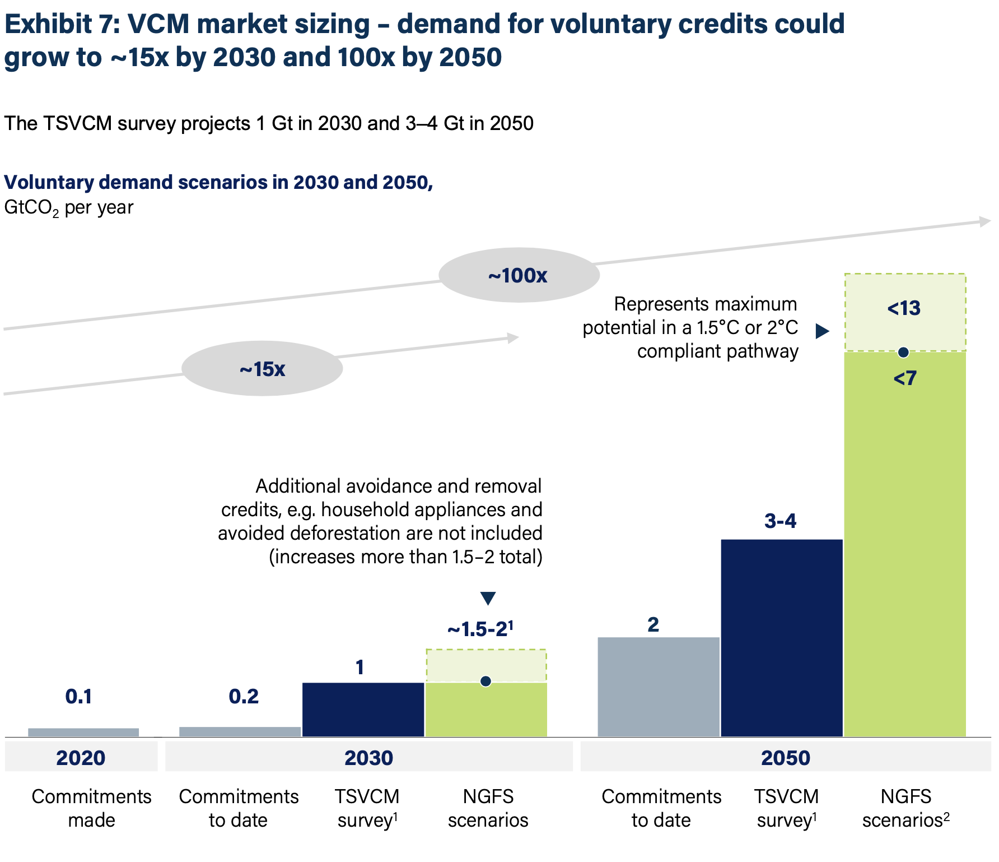
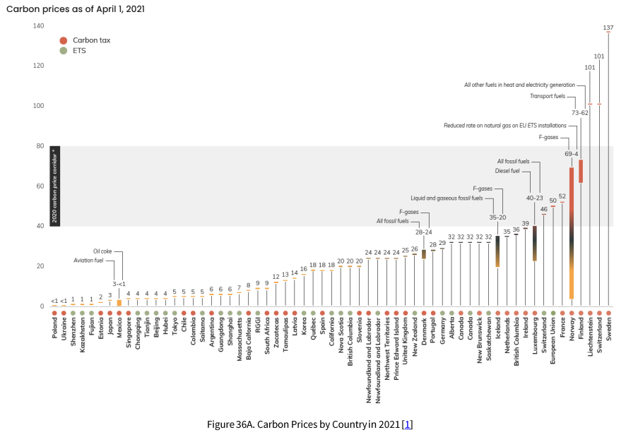
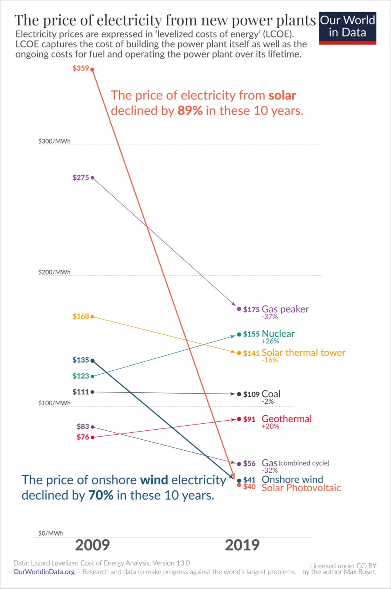
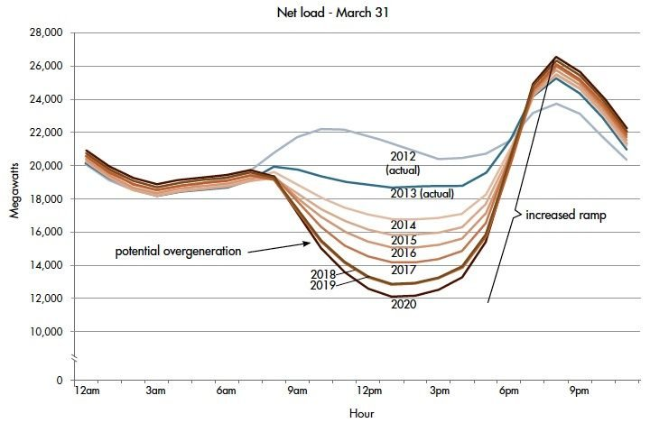

# New Asset Classes

_It's easy to do the math but hard to do the work. - Anonymous_

Ever wonder who would play you in a movie?

Unfortunately, Hollywood has been unkind to the financial whiz these days.  Just look at Mr. Big.  If finance is what you do, then you're a big short.

But what if you were actually using finance to save the world?  What if, instead of financing shopping malls, you financed forests?  Instead of bidding on futures, you bid on wildlife habitats?  Instead of structuring buyouts, you structured deals to stop climate change?

A [recent report from McKinsey](https://www.mckinsey.com/~/media/mckinsey/business%20functions/sustainability/our%20insights/putting%20carbon%20markets%20to%20work%20on%20the%20path%20to%20net%20zero/putting-carbon-markets-to-work-on-the-path-to-net-zero.pdf) says that this might even be possible.  This chart alone is already enough for some venture capitalists to open their wallets:

We might one day call this "the chart that launched a thousand startups."

But is it real?  

Part of it depends on what "Commitments" means.  Are they commitments to buy voluntary carbon offsets?  Net zero commitments from companies which could be fulfilled by voluntary carbon offsets?  Which must be fulfilled by voluntary carbon offsets because alternative decarbonization options are not available?  [I've asked McKinsey](https://twitter.com/opentaps/status/1494439046327668737)--hopefully they'll write back and let us know.

Meanwhile let's look at what kind of an asset carbon _might_ be, and what it _might not_ be.  Note this chapter is about project investing, not venture capital investing: We're not going to talk about how to evaluate novel technologies, but rather investing in the results of those technologies.  Carbon.  

## What are Carbon Assets?

With sustainability and green being slapped on every old thing these days, let's first narrow down what a carbon asset is.

For our purposes, let's define a __Carbon Asset__ as a quantified, exclusive, and unused traceable claims of climate benefit, such as a reduction or removal of Greenhouse Gas (GHG) emissions.  This definition helps narrow down what could be considered carbon assets:
- Climate Benefit: While Social Development Goals (SDG's) and biodiversity are important, there are a lot of compliance carbon markets that don't require any other attributes.  To be consistent, then, we should restrict ourselves to just the climate aspect of these.
- Quantified: It must be quantified in units such as tons of CO2 equivalents.  This would exclude all sorts of activities, products, and services which may be  better for the environment but which do not have a specific measurement of climate benefit and therefore cannot be valued or traded.  
- Exclusive: This is a requirement for being an asset.  While a climate positive activity benefits all of us, it could only be considered an asset if only one party could  claim it against their account of Greenhouse Gas (GHG) emissions.  You can own it collectively as a shareholder, or the government can claim it as state property, but being an asset means somebody owns it while others do not, so that it can be valued and traded.
- Unused: This claim must not have already been used in anyone's emissions account.  If a carbon credit has already been retired, than it has been consumed and is no longer an asset.
- Tradeable: Finally, this means a claim which could be bought, sold, or traded for other assets, rather than a climate claim which is an attribute of another asset which could not be separated from it.  For example, the LEED certification of a building could be an "asset" to the building, but it is not an asset that could be separated from the building and traded on its own.

Most carbon assets today are also verified by an external auditor, as required by compliance program regulators or voluntary standards organizations.  Verification of carbon assets is similar to due diligence for other assets: Nice to have, but not necessarily required.  For example, utilities' energy efficiency programs are often based on model or calculated energy savings, rather than actual data.  Two out of four options (A and B) of the [International Performance Measurement and Verification Protocol (IPMVP)](https://www.nrel.gov/docs/fy02osti/31505.pdf) allow energy savings to be calculated based on model data (A) or model plus some instrument readings (B).  If city or utility regulators institute a compliance carbon credit program that include utility energy efficiency programs, then those carbon credits would not require verification.
 
__Investing in a carbon asset__ is then the exchange of money for a stream of carbon assets.  It could be the purchase of equipment to reduce or remove emissions from the atmosphere, to plant new trees or restore a forest, and, as you'll see, lots of other activities.  

A carbon asset could have a lifecycle that involves many activities, such as capture, transport, and storage of the GHG emissions.  The buyer of the carbon asset pays for "permanent" removal or reduction of GHG emissions, and the payments are split between the activities of the carbon lifecycle.

And now for some very basic concepts, but maybe still worth repeating given how climate investments are marketed these days.

## Promises, Promises, Promises

The first thing you should think about is whether the investment is debt or equity.  Debt is a loan.  Equity is ownership.  Debt investments have promised regular payments, but limited upside.  The other party just has to make those payments to you.  Equity investments have no promised regular payments, but all the upside.  You own it!  As long as it keeps producing income, it should be all yours.  The flip side is that debt investments must be paid back before equity investments, and if things don't go well, their claims take precedence before the equity investors.  

Or so in theory.

The reality is, when you're ready to write the check, everybody promises you all sorts of protection.  But when the borrowers don't pay, the lenders are always the bad guy.  (Trust me -- I was a mortgage portfolio manager.)

For example, let's say your investment is a loan backed by solar panels.  In theory, if you don't get paid, you could get the solar panels back, put them at another customer's site, or sell them.  In reality, could you really turn off a customer's electricity, then go and physically remove the panels?  Or would doing so violate public safety and threaten basic livelihoods?  Or simply be so expensive legally as not to be worthwhile?  If so, then even though your loan is theoretically secured by a hard asset (solar panels), in reality it's an unsecured loan.

Or, let's say your investment is a solar or wind farm where a local utility buys the energy from you.  Then the utility goes bankrupt and stops paying.  Will the local regulators make you pay for the operations and maintenance expenses to keep the power on, while the courts figure out how much you'll get paid, and when you'll get it?  

Finally, remember that debt always relies on the kindness of strangers.  You need them to make a new loan at a later date to pay you back.  We call this "rollover" risk.  It happens because the projects themselves are very long-term, but term-matched funding is either not available, or borrowing for shorter terms is just less expensive.  Will those kind strangers always be there?  If it's an established asset class with a long history of financings, most likely.  If not, who knows?  Consider a fully-amortizing 30-year mortgage backed by utility assets versus a cryptocurrency stablecoin backed by a carbon project.  The former is a well-known, tried and true financing mechanism that pays itself off over time.  The latter is a novel bit of financial engineering that requires you to constantly provide cash-like liquidity to short-term holders from a long-term, illiquid asset.  

Moral of the story: Don't let promises lull you into a false sense of safety.

With that out of the way, get ready.  This is an asset like none other you've ever invested in. 

## What Could Possibly Go Wrong?

You're handing out cash for a promised stream of future claims denominated in units of CO2e of Greenhouse Gas emissions, then looking to sell those claims for cash again.  Every step of the way involves uncertainty, except the part with you handing out the cash.

### Technology Risk

OK, I lied.  Even though this chapter is not about venture capital investing, you're still going to have to evaluate some novel technologies.

The fact is, our understanding of large scale systems like climate and nature are relatively immature and changing.  We've been burning coal in large scale for the Industrial Revolution since the 1700's, but it wasn't until the 1960's that scientists started to realize the climate might be changing.  Meanwhile, our understanding of how nature and ecosystems work is changing as well.  

Taken together, it means that our attempts to capture or manage GHG emissions is just today's best estimate.  How well each of the following would actually work as the climate itself is changing remains to be seen: 

- Solar: Could a warming planet cause more cloudy days and reduce the output from solar panels? ([Princeton](https://www.princeton.edu/news/2020/10/07/climate-change-could-mean-fewer-sunny-days-hot-regions-banking-solar-power))
- Wind: How would climate change affect the amount of wind for wind power? ([Harvard](https://www.seas.harvard.edu/news/2021/03/less-wind-due-climate-change-wont-impact-wind-power-generation-india-and-china), [Nature](https://www.nature.com/articles/s43017-020-0101-7))
- Hydropower: Do hydropower projects actually contribute to climate change by releasing methane?  ([Science.org](https://www.science.org/content/article/hundreds-new-dams-could-mean-trouble-our-climate), [TheGuardian](https://www.theguardian.com/global-development/2016/nov/14/hydroelectric-dams-emit-billion-tonnes-greenhouse-gas-methane-study-climate-change))
- Mangrove forests: Will mangrove forests survive climate change and the related storms? (See [TheConversation](https://theconversation.com/extreme-weather-likely-behind-worst-recorded-mangrove-dieback-in-northern-australia-71880), [NPR](https://www.npr.org/2020/09/11/912045029/climate-change-may-wipe-out-large-mangrove-forests-new-research-suggests), [NASA](https://svs.gsfc.nasa.gov/13885))
- Forestry: How much do forests really help cool the climate? ([Nature](https://www.nature.com/articles/d41586-019-00122-z)  Furthermore, as the planet warms, some scientists believe that terrestrial forests will release more carbon than they absorb.  ([InsideClimateNews](https://insideclimatenews.org/news/13012021/forests-heat-climate-change/))  This may already be happening in the Amazonia. ([Nature](https://www.nature.com/articles/s41586-021-03629-6), [LiveScience](https://www.livescience.com/amazon-rainforest-accelerate-climate-change.html))
- Soil carbon: Could we actually be wrong about whether soil really sequesters carbon, or how much or how permanent the sequestration is?  ([Quanta](https://www.quantamagazine.org/a-soil-science-revolution-upends-plans-to-fight-climate-change-20210727/), [Nature](https://www.nature.com/articles/s41586-021-03306-8.epdf?sharing_token=AGbHLXt_20mbdUVLaFH7zNRgN0jAjWel9jnR3ZoTv0N2nuYqS5Si1oM85m9uPVbHtSoElmnSOceF_iSQhP1hfFAkwk2zkiuCDFYLMQUcWZ449oya-b_b0UwO-hnx_pjFJ9gmuFo7O9lrCLLifZ20c-ZUT3DZBSpOHb0b5Fqvp24p_KRkyABFbdQ1hqI_6thGftvWq4mOuSbtzwO5bbFqfwUKqJGWN8vrTjBiiyPdetYtiWWVN-8L521MmwBg1eZXB1F1oO9dbULOJm_v6RHa_mHW0Dy9Ace4IWWVVTMYb8kuX_vJ0IGvz0SucA1FUyCbYNZOtw4vqgJ_sbJefyGqSUJLCt5DfT1-hgvwcdK7bZg%3D&tracking_referrer=www.theguardian.com))

### Regulatory Risk

Or does it really matter?

Because for a climate benefit to become a Carbon Asset, somebody has to certify that it is legitimate.  So in the end, what matters is whether the certifier will accept your climate benefit, and whether anybody would care what the certifier says.

There are three kinds of certifiers, each of which creates its own type of carbon markets: voluntary, compliance, and industry.  Voluntary certifiers are entities such as The Gold Standard, VERRA, Carbon Plan, Climate Action Reserve, and Global Carbon Council, among others.  They establish methodologies and certification processes, review projects, and issue voluntary carbon offsets.  The keyword here is "voluntary": The offsets are not required by any regulatory entity, and so they are for use as you'd like.  Concerned about the climate impact of your wedding or honeymoon trip?  Buy some offsets and retire them in your name.  Want to tell your customers you're a sustainable brand?  Buy some offsets and put it on your website.  As a result, voluntary offsets support a large set of potential project types, developers, and users all over the world (see [our paper](https://papers.ssrn.com/sol3/papers.cfm?abstract_id=3981914) for a breakdown of the market.)  The downside is that the market is very small and the prices low.  

The compliance market is the opposite.  They are run by government agencies, usually as part of cap and trade emissions reductions programs, and companies are required to buy credits when their emissions are over the allowed amounts.  As government programs usually go, they are politically negotiated, target only the largest companies in key sectors, allow only certain types of emissions reduction or removal projects, and have rules and enforcements that may seem arbitrary to anybody outside the bureaucracy.  The best example is the European Union's Emissions Trading Scheme (ETS), which is a GHG emissions cap and trade program in all 27 EU countries plus Liechtenstein and Norway.   It covers major GHG emissions sectors including electricity and heat generation, heavy industrial manufacturing, and commercial aviation, for a total of about 40% of total emissions in the EU.  At $200 billion per year, it is the largest carbon market in the world.  But it is not the only one.  China launched its emissions program in 2021, focusing initially only the power generation sector and using emissions intensity rather than absolute emissions as its metric.  Finally, a bevy of other national, state, and regional compliance carbon markets such as California Air Resource Board's cap and trade program exist all over the world.  As a result, the price of carbon varies widely from country to country:

Finally, some industries are organizing carbon markets of their own.  The best example is CORSIA, the Carbon Offsetting and Reduction Scheme for International Aviation, a consortium organized by the UN's International Civil Aviation Organization (ICAO).  CORSIA covers international flights of most major international airlines (except India and China) and mandates measurement of total emissions, reducing emissions through efficiency improvements, and offsetting.  Itpublishes a [list of eligible voluntary carbon credits](https://www.icao.int/environmental-protection/CORSIA/Pages/CORSIA-Emissions-Units.aspx) that could be used.  A key motivation for CORSIA was that international flights did not fall into any particular country's emissions account and therefore their Paris Agreement obligations.   Since many supply chains also span multiple countries, other industries may follow suit with carbon markets as multinationals try to manage their emissions and climate risk profiles.   

A subtle but important difference between voluntary offsets and compliance carbon credits: Voluntary offsets are based on the concept of additional emissions reductions or removals.  To be a valid offset, the project must've not been possible without funding from the offsets, and the amount of offsets issued must be additional to a business-as-usual baseline.  Compliance credits are based on actual quantities of emissions versus a legally allowed cap.  You pay if you're above your limit.  It's that simple (well, no, nothing with a government regulator is ever simple, but ...)   As a result, for example, renewable energy projects may not qualify as valid voluntary carbon offsets because the low cost of wind and solar have made them the standard business choice, but they would definitely qualify for compliance credits if they lower your regulatory emissions account.

Markets like these are made for arbitrage.  Given the differences in prices between voluntary markets and the different compliance markets, who could resist trying to choose the right market for your carbon assets, or even transferring credits from one to another?  The landscape is also changing over time: For example, the voluntary carbon offsets certifiers have been working with government regulators to have their projects be accepted into compliance schemes.  Government regulators may also see voluntary offsets and industry consortia as a way to meet climate goals.  [Sweden's acceptance of carbon offsets from the Gold Standard](https://www.goldstandard.org/blog-item/gold-standard-and-swedish-energy-agency-partner-ensure-integrity-international-cooperation) and [potential EU legislation](https://ec.europa.eu/info/sites/default/files/notification-carbon-offsetting-and-reduction-scheme-international-aviation-corsia_en.pdf) requiring member airlines to comply with CORSIA may well be harbingers of what's to come.  Finally, there is at least one nice arbitrage between Renewable Energy Certificates (REC's) and carbon markets (shhhh...)  The [California Low Carbon Fuel Standard](https://ww2.arb.ca.gov/our-work/programs/low-carbon-fuel-standard) allows using REC's to claim that your electric vehicles were charged with renewable energy, so that you could earn a carbon credit versus standard transportation fuels.  With prices as high as $200 per ton, this might be the most expensive carbon market in the world.  All you need is a transportation fleet, and some EV chargers. 

Meanwhile, concerns about the quality of the credits also eventually drive the prices, but in different ways.  In the voluntary offsets market, participants react like in most markets -- If bad news pile up, prices fall (remembering that it is a very small and fractured market.)  For example, renewable energy projects have traded to less than $1 per ton CO2e because participants no longer believe they are additional.  The problem with voluntary carbon offsets is that the market is traded over the counter and fairly illiquid, so you may not have a chance to adjust your position in time.  In compliance markets, the regulators may change the rules after criticism, such as [concerns about too many free credits under the EU ETS](https://www.eca.europa.eu/en/Pages/DocItem.aspx?did=54392) leading to [potential rule changes](https://www.euractiv.com/section/emissions-trading-scheme/news/leaked-the-eus-carbon-market-reform-proposal/).  This is a slow, political process similar to rezoning.  If the market is driven by end user compliance demand rather than trading, then there would be time to react.  

We'll have to see how fluidly industry carbon markets such as CORSIA behave.

### The Other Usual Risks

At the risk of becoming a prospectus filled with pages of warnings nobody seems to read, here are the usual risks of any project finance deals you _should_ be aware of:

Term matching: Are the prices for the carbon assets locked in for the life of your project, or will you get the market price over time?  If the latter, how will it change?

Market risk: During the pilot phase, there are philanthropic funders who will pay to help new technologies get off the ground.  But to scale up for mass adoption, the technology will have to tap into the next tier of buyers, who may not be so generous.  For example, today people are willing to $200 or more per ton for pilot pilots of direct air capture.  People are also willing to pay up for nature-based solutions with a lot of co-benefits to the development of local communities.  But both are small.  If these projects are going to scale up, they'll have to tap into compliance markets, where carbon is just carbon.  They'll have to be priced competitively versus the cheapest credits available in those markets.

Obsolescence risk: This is the opposite to market risk.  Certain types of carbon credits have fallen out of favor and lost value over time.  For example, renewable energy was a dominant part of the market, but the falling prices of renewables have made carbon credits unnecessary for supporting them.  As a result, existing carbon credits from projects issued years ago have fallen in value.  Are they any less valid now that new renewable energy projects are no longer eligible for carbon credits?  Technically, no -- the contracts are valid for the term of the credits.  But that's small consolation to the project developers, whose credits are worth less and less.

Currency risk: In case the project is in another country.

Liquidity risk: If these are long term projects, will you be able to sell your interest in the project if you need the money for something else?  If you are planning to finance them, how will your lender appraise your project?  Could there be additional capital requirements from your lender?

Counterparty risk: How likely are the project developers to develop the promised carbon assets?  How likely are the buyers to purchase the carbon assets they've promised to buy?  What happens if either side fails to do as promised?

Basis risk: If you're thinking about using carbon assets to hedge your stocks' climate risk, don't.  There is no correlation -- for example, [our paper](https://papers.ssrn.com/sol3/papers.cfm?abstract_id=3967613) found no correlation between the European Union Allowances (EUA) futures for GHG emissions rights and the stock market.  

## Lessons from Renewable Energy 

Before speculating on how investments in carbon assets would turn out, let's take a look at a real, successful example: Renewable Energy.  

Renewable energy, such as wind and solar, have been around for a long time.  Medieval windmills dot the scenic Low Countries of Europe, while NASA's Skylab featured prominent solar panels back in the 1970's.  Neither was a significant source of energy, though, until the oil crisis of the 1970's plus the environmental concerns about burning coal and then climate change.  Then, government investment in R&D improved the technologies, while policies such as the Renewable Portfolio Standards (RPS) for utilities created a boom in demand which led to manufacturing efficiencies and falling costs.  From 2009 to 2019, the cost of solar energy declined an astonishing 89%:

This now makes solar and wind the least expensive sources of energy available (when the sun shines and the wind blows, that is.  Storage for the rest of the time remains a big technological hurdle.)  

So what happened to carbon assets based on renewable energy?

In the 2000's, when renewable energy was expensive, they were purchased as part of government mandated programs such as the RPS.  Buyers supported the market by entering into long-term offtaker agreements at premium prices.  Meanwhile, two types of virtual certificates were available to help funnel investment in renewable energy.  One was the Energy Attribute Certificate (EAC's), also known as Renewable Energy Certificates (REC's) in the US.  EAC/REC's simply attested that energy was generated from renewable sources, and they transferred the renewable or green attribute of a commodity, electricity, to buyers who needed that attribute.  They were mostly bought by utilities to meet their RPS mandates.  Through EAC/REC's, buyers who were willing to pay the green premium for renewable energy were essentially pooling their purchases to reach the amounts required for actual plants and facilities.

The other virtual mechanism was carbon offsets, which is a more direct carbon asset based on the emissions reduction of renewable energy versus standard grid electricity.  The [Clean Development Mechanism's methodology (ACM0002)](https://cdm.unfccc.int/methodologies/DB/XP2LKUSA61DKUQC0PIWPGWDN8ED5PG) was also adopted by the voluntary carbon offsets standards organizations such as Verra and Gold Standard to issue carbon offsets based on renewable energy.  A key requirement was that renewable energy projects would not be economically viable on their own, so carbon offsets were "additional" in their emissions reduction.

By mid decade of 2010's, the prices of renewable energy had fallen so much that they were in fact economically viable, but carbon offsets could still be issued based on the rules of the time.  As a result, they were basically free money for project developers, and there was a boom in renewable energy-based offsets.  They became the dominant sector of carbon offsets.  Prices fell as a result of supply and as buyers began to recognize that the projects were not truly additional any more, falling to as low as $1 per ton CO2e by 2021.

Finally in 2021 the Verra and Gold Standard both revised their rules to exclude grid-connected renewable energy projects from their carbon offsets standards.  They now require projects to be either non-grid connected or to be in very low income countries.  However, other standards will still certify these types of projects, and therefore they are still issued and accepted into programs such as CORSIA's carbon offsets regimes.  This has held down the general price of voluntary carbon offsets, since cheap large scale renewable energy projects are a plentiful source of "cheapest to deliver" offsets.

There was a similar fall in the prices of EAC/REC's, as plentiful renewable generation during peak hours led to a flood of certificates being issued.  While some RPS programs still accept them, others are tightening up to require that the certificates be matched to the time and grid location of generation, so that they actually account for energy at a time that was needed.  Initiatives such as [Google's 24/7 Carbon Free Energy](https://sustainability.google/progress/energy/) and [EnergyTag](https://www.energytag.org/) are examples of how the industry is becoming more sophisticated in its use of EAC/REC's.    

Finally, the renewable energy as a sector continues to grow, but because they are now an economically competitive asset, the market is also changing.  Long-term offtaker agreements are increasingly being replaced by merchant power agreements, where project owners are selling energy on shorter contracts or even at spot prices. 

----

### Trade Risk

How will this change over time?  Renewable energy is so big and mainstream now, there is too much of it at peak hours (duck curve.)  Will incentives such as net metering still be around?  Will utilities change their tariff rates to time of use so that peak renewable generation is worth less?  

NGFS Carbon price projections here.

Carbon asset investing cycle - renewable energy example
Early days - high cost, high technology risk - long off taker arrangements, public support, carbon credits
Now - proven technology, commercially viable - merchant power arrangement, no carbon credits, direct sales of electricity, declining need for net metering due to duck curve.  Storage is the next frontier.

Voluntary market - large variety, story specific
Compliance market - ton of carbon is ton of carbon.  Commodity.  Compete with other options at best price.  Much larger

Tech must transition from voluntary to compliance markets.

## Renewable Energy

No longer a climate bet but an energy bet.  More like project finance investing: counterpart risk, off taker agreements, net metering.  Shift to merchant power from long off taker agreements.  Key technological issue is storage. "I've lost more money on battery companies than anyone," - Bill Gates.  

## Carbon Credits and Offsets

Early days - Lots of different standards.  Eventually market will converge either to the government compliance standards or large private sector ones.  Will your project make it?

Compliance carbon credits: Understanding the government regulations.  For example: Europe's overallocation of credits.  China's emissions intensity standard.  Expanding to new sectors.  Push back against financial investors and speculators.

Voluntary carbon credits: Very heterogeneous market, over the counter, illiquid.  TSVCM recommends futures contract but look just at the Gold Standard marketplace, Ecosystems Marketplace survey -- there is such a big range a futures market won't cover much of it.  Also see the BCT -- exactly the cheapest offsets got tokenized.

Voluntary carbon offsets market prizes novelty, pays up for unusual project types.  Once technology hits mainstream questions about additionality plus supply pushes down the values.  There is a period between when the technology is mature and market ready and when offset standards start to rein back issuance -- Renewable energy: [2016 paper](https://ec.europa.eu/clima/system/files/2017-04/clean_dev_mechanism_en.pdf) pointed out most CDM projects were not additional.  In 2021 Verra and Gold Standard modified their renewable energy methodology to exclude projects which are not in the lowest income countries.  During this period lots of potential supply ("free money") will push down prices.

## Policy

Failure of California's deregulated electricity market.  Challenges to high prices from "speculators" in EUA market.  Prices must fall for the market to scale.  

## Whose Credit Is It?

Why not many European voluntary offsets?
Compliance market altakes over

## Investment 

Some general recommendations:

- Find a public equivalent to what you're planning to invest in.  For example, Hannon Armstrong (HASI) is a public company that owns solar and other renewable energy assets.
- Get a liquidity premium of at least an additional 1% in return or 20% in valuation for a private investment versus a publicly traded alternative.  In real estate terms, that's a 5% cap rate for a private investment versus a 4% cap rate for a publicly traded one.  This is __fair value__.  If you can get more, it's even better.
- Volumes must go up, prices must come down in most markets.
- Early stages: 
- Diversify

It's possible you'll be right and make money.

It's also possible that you'll be wrong and lose money.

Most annoyingly, it's possible that you'll be right and lose money anyway.

## Are they a Hedge?

It's hard to know how the world of 2100 will look.  Who, in 1942, could've foreseen the world we live in today?

If we fail to stop climate change, how will the world change?  Carbon credits are a market-based mechanism for reducing human activities that cause climate change.  How much of our free trade and free financial flows survive?  Or will governments hoard their resources?  Will carbon credits still even exist or have any value?   

Scenarios to think about:
1.  No government collaboration—voluntary market only.  Will it do much?  Tiny, disorganized market probably will not be enough to transition the economy to 1.5 - 2 degree targets.  If the transition fails and the world switches to adaptation, will these credits have any value?
2.  Carbon becomes sovereign asset.  Government scoops them up for NDCs.  Prevent private sector speculation.  Debt funding only via green bonds.
3.  Hybrid model—government tender for carbon.  Trading and arbitrage between countries and transfers.

#### Get Updates

[Sign up](https://opentaps.org/subscribe) for our email newsletter to get updates on this book and the [Open Climate Investing project](https://github.com/opentaps/open-climate-investing).

#### Disclaimer

_This content is published for informational purposes only and not investment advice or inducement or advertising to purchase or sell any security.  See [full disclaimer](Disclaimer.md)._