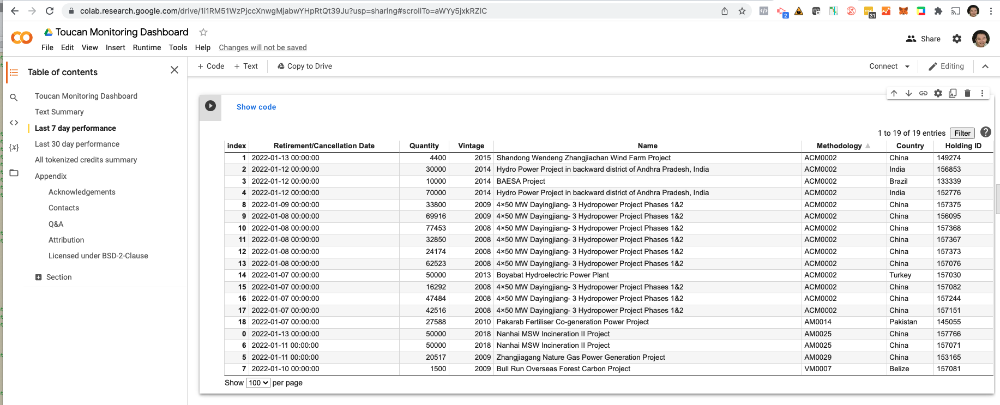
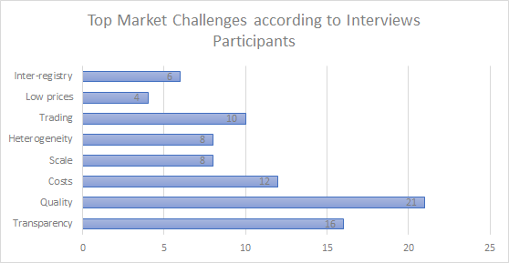
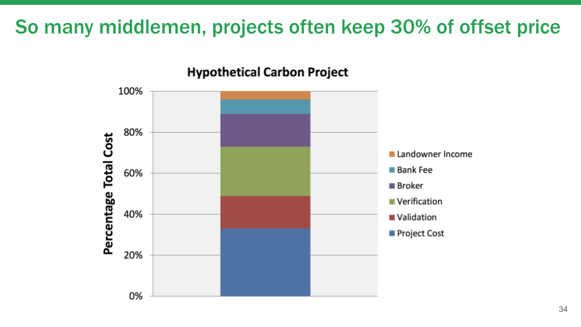
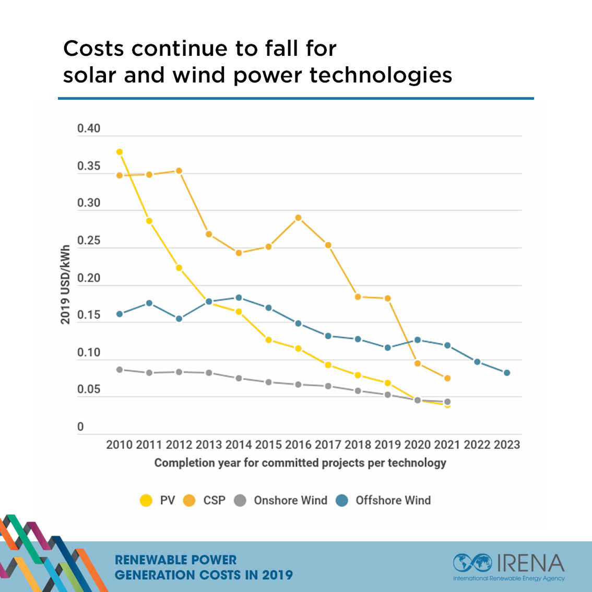

## Emerging Technologies

_The ability to speculate on a cryptocurrency is insignificant next to the power of the Blockchain. - Darth Vader_

### Planet Crypto

_Luke Skywalker: I feel the Force!_
_Obi-Wan Kenobi: But you cannot control it!_

There's been a disturbance in climate finance.  The long obscure world of carbon offsets has collided with the red hot crypto universe.  The new technorati are turning to offsets as no less than a way to overturn the existing economy and financial markets.  They want to usher in a new world order of "regenerative finance" to heal (or, as they prefer, "unf*ck") the planet.  Their manifesto could be summed up as the following:

- The existing economy, with its governments, financial markets, and Paris Agreement, will not be able to stop climate change.
- To stop climate change, we need real financial incentives.
- To create those financial incentives, let's start a cryptocurrency backed by carbon offsets.  This varies from buying existing carbon offsets to commitments to buy carbon offsets from carbon direct removal projects.
- Let's use all the tools of Decentralized Finance (DeFI) to draw in speculators, who'll ape (_v: [deploy large sums of capital with minimal diligence](https://keepcool.co/klimadao-deepdive/)_) and pump up  the cryptocurrency.
- Higher price for the cryptocurrency will lead to higher prices for offsets, which will finance more projects to unf*ck the planet.

Perhaps the best example of this today is the combination of the [BCT](https://docs.toucan.earth/protocol/introduction/defi-refi) and [KLIMA](https://www.klimadao.finance/) tokens.  The BCT "bridges" the carbon offsets and the blockchain by retiring one ton of offsets in the Verra voluntary carbon offsets registry and then creating a fungible ERC20 token on the Polygon Ethereum Layer 2 network representing one ton of carbon.[[1]](#footnote-1)[[2]](#footnote-2)  KLIMA then created a new cryptocurrency based on BCT and used staking rewards, where holders of the KLIMA could deposit them in the treasury to earn additional KLIMA tokens, to draw in buyers.  With a discord channel of over 40,000 members, the KLIMA token traded as high as an $3,777.30.  

To true believers, this must be exactly the [Promise of Web3](https://mirror.xyz/0x26163318B9972E41A734602Fe00A5683D233613f):

_...to be totally opposed to web3 necessitates a strong belief that the incumbent system is good enough, with USD as the global reserve currency, the Federal Reserve printing money at will, and Big Tech owning your data and original content. It’s not hard to speculate that most people who think they’re opposed to web3, are actually believers who just don’t know it yet._

_One of the great things about crypto is how it democratizes access to investments._

_In order to gain access to early stage startup investment deals in tech, you've traditionally been required to be accredited and connected in Silicon Valley. In theory, the only true barrier to entry in crypto should be awareness._

_When you envision a future where any human can easily invest any amount of any asset into anything or anyone at any time, the future of traditional investing begins to appear bleak indeed._

_Founders have many new ways to fundraise with less friction. This means more focus on ideation and execution of the business, with less schmoozing, building decks, and painstaking interaction with legacy financial systems._

_Web3 will lead to unprecedented value creation because it provides exponentially better methods for the appraisal and management of digital property._

Meanwhile, those of us in the old fashioned world of carbon offsets might notice a few interesting things:

- Most of the carbon offsets used to back BCT and KLIMA are renewable energy offsets such as hydropower in China and Brazil (Source: [Toucan Monitoring Dashboard](https://colab.research.google.com/drive/1i1RM51WzPjccXnwgMjabwYHpRtQt39Ju?usp=sharing#scrollTo=aWYy5jxkRZlC)) 
- These offsets were trading with an average price of $1.1 as recently as September 2021.  (Source: [Ecosystems Marketplace](https://www.ecosystemmarketplace.com/articles/press-release-voluntary-carbon-markets-rocket-in-2021-on-track-to-break-1b-for-first-time/))
- When the offsets are "retired" from the Verra registry, it means that they are used to offset the emissions footprint of the retiring party (retiree?)  They should never be traded again and therefore have no value any more.  Toucan Protocol, creators of the BCT token, acknowledges that it is a [one way bridge](https://docs.toucan.earth/protocol/bridge/carbon-bridge).
- In other words, BCT tokens and anything based on it could only be considered assets by those who believe.  They could never be converted back to offsets and traded in the existing offset markets.  They're a one way ticket to Planet Crypto.
- Is it ever really possible to [create a liquid asset from an illiquid one](https://www.oaktreecapital.com/docs/default-source/memos/2015-03-25-liquidity.pdf)?

You might look at all this and shake your head, "We've seen this all before."  Or, as [Tim O'Reilly puts it](https://www.oreilly.com/radar/why-its-too-early-to-get-excited-about-web3/):

_Repeat after me: neither venture capital investment nor easy access to risky, highly inflated assets predicts lasting success and impact for a particular company or technology._  

_Cryptocurrencies may well be the future of finance, but at the moment it’s hard to see what’s really working, given how much smoke is being blown._

_The failure to think through and build interfaces to existing legal and commercial mechanisms is in stark contrast to previous generations of the web, which quickly became a digital shadow of everything in the physical world—people, objects, locations, businesses—with interconnections that made it easy to create economically valuable new services in the existing economy. The easy money to be made speculating on crypto assets seems to have distracted developers and investors from the hard work of building useful real-world services._

But if you think this is just a rerun of the dotcom boom, with discord channels replacing AOL chat rooms and cyrptocurrencies replacing AOL, CSCO, and YHOO, you might've missed an important detail.  The dotcom boom of the late 90's was about technologies.  People speculated on stocks which represented ownership interests in the companies and their technologies.  Today's cryptocurrencies are not so much about the technology -- blockchains, smart contracts, and consensus mechanisms -- as they are about financial engineering and financial leverage.  In that way, they're more similar to the junk bond/LBO boom of the 1980's and the conglomerate boom of the 1960's.  If you read about letter stocks, zero coupon convertible bonds, and pay-in-kind bonds, you'd find eerie similarities to today's crypto tokenomics.

So where do we go from here?  It's easy to dismiss it as the worst excess of crypto speculation ($1.1 to $3,777.30 should set a record for "alchemy of finance" somewhere.)  

But isn't it more fun to speculate (ha ha) about what happens if this is the wave of the future?  

What happens if Revolutionaries of today won and became the Oligarchs of tomorrow?  

Will they horse trade like COP26, across all the DAO's that seem to be forming up daily on Discord to fund carbon offsets, carbon removals, regenerative agriculture?  

How will they meet the needs of speculators and short-term traders while working on a very long-term problem like climate change?  Those interests are not naturally aligned.  For example, to stop climate change, we need to ramp up the amount of carbon offsets/reductions/removals, but the value of any currency, crypto or otherwise, increases when there is less supply of it.  

Furthermore, the treasury behind any currency, crypto or otherwise, gains when it mints liabilities (tokens or currency) at a higher value than the reserve assets (in this case, offsets.)  Unfortunately, there are plenty of low price offsets that could be created, even now, under approved standards and methodologies.  They could boost the treasury and cryptocurrency values while having no positive or even negative climate impact. 

Finally, will the offset market really accept speculators?  Developers would probably welcome higher prices but not volatility, which would make financing long-term projects more difficult for them.  Buyers benefit from lower prices and would call foul if outsiders push up prices.  Whatever happens, everybody will blame "financial players," especially the hated "speculators," who provide an easy excuse to discredit the whole system.  Already we see this in the European Union's Emissions Trading Scheme (ETS): [Poland, Spain, and Czechia are protesting](https://www.euractiv.com/section/emissions-trading-scheme/news/europes-energy-price-hike-fuelled-by-speculators-spain-and-poland-say/) that financial players are driving up the cost of electricity and must be barred from the market.  [Poland and Czechia have even called for suspension of the ETS.](https://www.euractiv.com/section/politics/short_news/czech-minister-would-support-polands-call-for-suspension-of-eu-ets/)  

Time will tell.

Meanwhile the world continues to move forward.  Web3 is a new set of technologies.  Its effects are right now less obvious because it does not itself do something differently, but rather organizes the doing differently, sometimes radically so.  If it could be linked to real world activities as Tim O'Reilly suggests, then it could unlock tremendous possibilities for climate action.  Let's look at a few examples.

### Supply Chain Emissions

Imagine you're a major corporation.  You purchase products from all over the world, from suppliers who purchase parts from all over the world themselves.  You want to reduce your emissions footprint.  How do you know where to do it?  Do you encourage your suppliers to switch to renewable energy or low carbon alternatives?  Do you switch suppliers?  Reconfigure your logistics networks?

Now imagine you're a high emissions manufacturer, for example a steelmaker.  Your products are sold all over the world, used to manufacture parts and products of all kinds, and then re-sold and re-shipped all over the world.  You also want to reduce your emissions footprint.  But is it worth it to make the massive capital investment needed?  Would any of your customers pay for, or even care about, a lower carbon product from you?

Amazingly, neither company could answer these basic questions right now, because we simply don't know where the emissions are through the vast global supply chains.  Emissions footprints, when they are reported at all, are at the company level.  Emissions reductions programs, where they exist, are at the national level.  Since supply chains run multi-levels deep across the world, we quickly lose track of where the emissions are occurring.  The best we could do is rely on lifecycle analysis database such as EcoInvent to give us estimates of the emissions for different products.  As a result, companies don't know what their true emissions are.  There's no incentive for suppliers to reduce emissions below the database averages, and every incentive for them to cut costs and make products with higher emissions than the averages.  Where climate regulations exist, it's easy to hide them in the supply chain by moving production somewhere else.  This is exactly why the European Union is considering the [Carbon Border Adjustment Mechanism](https://ec.europa.eu/taxation_customs/green-taxation-0/carbon-border-adjustment-mechanism_en)

Solving this problem is not easy.  Since supply chains span across borders, we cannot rely on the traditional government authorities to require audits and enforce limits.  The blockchain, however, could solve this problem because it allows collaboration without a central authority.  Members of a supply chain could use it to form a network to measure and reduce emissions:

- A distributed ledger could hold immutable emissions records from members of the supply chain so that they could be available for audits.
- Tokens for emissions footprints could be issued to supply chain partners for purchases and transportation as they happen, based on ERP data or invoices.
- Smart contracts could set limits on total emissions for each member with penalties and rewards for higher or lower emissions, similar to a cap and trade scheme.  

We currently have a [Supply Chain Emissions Ledger Project](https://wiki.hyperledger.org/display/CASIG/Supply+Chain+Emissions+Ledger+Project) hosted under the umbrella of the Linux Foundation's Hyperledger open source project to implement some of these concepts.  [Sign up](https://opentaps.org/subscribe/) to get updates about our work there.

### Ratings

_Given enough eyeballs, all bugs are shallow. - Linus Torvalds_ 

Quiz: Which of the following companies has the highest market capitalization?

- Colgate-Palmolive
- eBay
- FedEx
- General Motors
- IBM
- Lockheed
- Marriott
- Moderna
- Standard & Poors

Answer: Standard & Poors.

If you've ever worked in the industry or read [The Big Short](https://amzn.to/3yt2bSs) by Michael Lewis, you'd be excused for thinking that S&P and Moody's were the poor relations of Wall Street.  But you're wrong.  They are the Matrix of high finance.  They are everywhere.  They are all around you.  If money makes the world go around, then information makes money go around.

And now they're setting out to provide ratings for climate investing.

It's too easy to criticize the ratings agencies and their much smaller cousins, the standards organizations of the voluntary carbon offsets market.  When times are good, they're the bureaucratic gatekeepers who prevent access to capital.  Everybody cheers startups that are "democratizing access."  When times go bad, though, it's the rating agencies that are subject to [Congressional investigations](https://www.hsgac.senate.gov/imo/media/doc/PSI%20REPORT%20-%20Wall%20Street%20&%20the%20Financial%20Crisis-Anatomy%20of%20a%20Financial%20Collapse%20(FINAL%205-10-11).pdf).  We take for granted the fact that credit ratings, by and large, do work: Lower rated companies are more likely to default.  Overall, the ratings provide a way for investors to limit their risks and companies to raise capital.

Yet when they fail, they fail spectacularly.  The collective mis-rating of subprime mortgage securities led to the near collapse of the global financial system.  A similar mistake with climate risks could lead to the collapse of a lot more.  Even today, there is doubt about whether the ESG ratings are helping us with climate change, or if they are a [mirage](https://www.bloomberg.com/graphics/2021-what-is-esg-investing-msci-ratings-focus-on-corporate-bottom-line/), a [bubble](https://www.bloomberg.com/news/articles/2021-10-28/trillion-dollar-esg-boom-rings-bubble-trouble-alarm-in-new-study), or a [fantasy](https://www.institutionalinvestor.com/article/b1tkr826880fy2/The-Trillion-Dollar-Fantasy)? 

The problem with ratings lies in the system:

- Ratings agencies develop methodologies, which are modified periodically.  
- Both the methodologies and ratings are produced by people with similar backgrounds using similar data. 
- They rely primarily on information from corporate issuers.  
- They are paid by the issuers to rate new issuances of securities.  Most of the resources are therefore allocated to rating the issuance of securities.  Follow-on monitoring of existing securities is underfunded.  Further, negative opinions are naturally "controversial" and likely to elicit harsh blowback, so the analyst better be sure.  

The result is that all the major rating agencies usually assign about the same ratings and keep them relatively static over time.  Only when there is drastic news do they go back to reassess those ratings, and then, when they are sure, it's a race to downgrade before defaults roll in.  

Seeing this, does it make sense why [Moody's](https://www.politico.com/f/?id=00000176-6343-df7e-a37f-f7d32a810000) would say the following about climate risk, which always seems to be far on the horizon?

_our ability to forecast the impact of trends that will only unfold far into the future is necessarily limited. Nearer-term risks generally have a more direct impact on ratings because there is typically far greater certainty of their impact on credit profiles. As a general principle, as the time frame for a source of risk lengthens, the less certain we can be of its impact on an issuer’s cash-flow-generating ability and other credit metrics, and the less clarity we have regarding the importance of that risk in relation to other risks the issuer faces. For example, longer time frames give an issuer more time to adapt by lowering costs, adopting new technologies, or realigning its business model, budgetary spending or balance sheet to changed circumstances; however, some issuers may not be able to or may fail to take effective mitigating actions._

Is it also any wonder why [ESG ratings services would grade on a curve](https://www.bloomberg.com/graphics/2021-what-is-esg-investing-msci-ratings-focus-on-corporate-bottom-line/) relative to their peers and prefer to upgrade rather than downgrade companies' ESG ratings? 

This is where the Distributed Autonomous Organization (DAO), a relatively lesser known mechanism of the blockchain until recently, comes into play.  A DAO is a way to organize collective decision making amongst otherwise unaffiliated members (hence "distributed.")  Instead of a group of analysts working for a company, a DAO could allow anybody to play a role in setting a rating.  The DAO could be algorithmically set up to protect both sensitive data from issuers and objectivity of the analysts and use tokens to distribute rewards and assign reputations.  Think of it as a TripAdvisor model, but with more rigor.

Such a DAO could introduce a broader, more diverse range of inputs.  We do not have to wait for information to filter up to the ivory towers of the rating agencies through third party research reports or the issuers themselves.  Instead, ground truths from observers close to the action could alert us to important changes sooner.  We also do not have to rely solely on the handful of ratings agencies, who by employing similar analysts to produce similar ratings have become a single point of failure in the markets. 

As an example of a DAO, see the [DAO proposal](https://github.com/opentaps/open-climate-investing/tree/main/dao) for governing the development of this book and the related project.  

### Better Offsets

_You're going to find that many of the truths we cling to depend greatly on our own point of view. - Obi-Wan Kenobi_

What does the offset market _really_ need?

In a [recent paper](https://papers.ssrn.com/sol3/papers.cfm?abstract_id=3981914) sponsored by the Linux Foundation's Hyperledger project, we found that the top concerns of the offset market participants were actually Quality, Cost, and Transparency:

The blockchain could address each of those in turn.

First, Cost:  Offsets are very expensive to issue.  After all the fees, only about 30% of the price of the offsets actually go to the projects:

 

A large part of these costs is the fees for auditors to validate and verify the project, including site visits, project documentation, and records of project activities.  While obviously a critical step, it is also often a labor-intensive, paper and spreadsheet process today.  The blockchain could significantly reduce these costs through "Digital Measurement, Reporting, and Verification (Digital MRV)" by automating the collection of data from many participants on a distributed ledger.  

Second, Transparency:  At first blush it might be hard to see what the issue is.  After all, the offset registries keep detailed records, and the data available is available on their websites or from sources such as the [Berkeley Carbon Trading Project](https://gspp.berkeley.edu/faculty-and-impact/centers/cepp/projects/berkeley-carbon-trading-project) and our [Open Offsets Directory](https://offsets.opentaps.org/).   Indeed, [our paper](https://papers.ssrn.com/sol3/papers.cfm?abstract_id=3981914) found that this was a greater concern for regulators and government agencies than for the project developers and offset buyers.  This is because the problem arises because there are so many carbon credits and offsets registries, both for government compliance programs and for voluntary offsets.  If a project developer registered the same project on two registries, such as a government registry and a voluntary offset registry, it would be difficult to detect.  This is the [double counting problem](https://keepcool.co/klimadao-deepdive/) that many crypto carbon projects have cited as a top concern for the offset market.

This problem cannot be solved by just tokenizing the offsets from one registry, however, because that registry could not guarantee that the credits have not been issued elsewhere.  It could only be solved by creating a meta-registry of carbon credits and offsets from _all_ the registries, both government compliance and voluntary ones, so that the data is available for cross-checking.  The [World Bank Climate Warehouse](https://www.worldbank.org/en/programs/climate-warehouse) is a project aiming to do just that with a blockchain that connects multiple carbon registries.  It would support transfer of credits between registries, solving the tokenization versus retirement problem of the BCT token, as well as provide data for a global view of the carbon credits market.

Finally, Quality:  It must be disheartening to be an offset project developer.  You do all the work, spend lots of money to get it verified, only to hear it disparaged.  Not disparaged by climate deniers, but by the very environmentalists that should be your strongest supporters.  Yet they do not hold back.  [Project Drawdown](https://drawdown.org/news/insights/opinion-the-world-needs-better-climate-pledges) calls offsets "problematic," "dubious," a "shell game", and "imaginary."  Greenpeace is more blunt: [Carbon Offsets are a Scam](https://www.greenpeace.org/international/story/50689/carbon-offsets-net-zero-greenwashing-scam/), "a bookkeeping trick" and "the next big thing in greenwashing" that "feigns compassion," "preys on fear," "takes advantage of uncertainty," and is driven by "Greed" - "Big Oil and corporate polluters want to keep putting profits over people and the planet."

These critics raise some valid points, even if they offer no viable solution.  First, there are many low quality, low cost projects which are available, and certainly some parties could buy them to make empty climate claims.  At the heart of the problem is "Additionality," the requirement that a project could not have taken place without funding from the offsets.  [Gold Standard explains why this is crucial](https://goldstandardhelp.freshdesk.com/support/solutions/articles/44001989691-what-does-additionality-mean-and-why-is-it-important-):

_Additionality is a defining concept of carbon-offset projects. To qualify as a genuine carbon offset, the reductions achieved by a project need to be ‘additional’ to what would have happened if the project had not been carried out (e.g. continued as business-as-usual). For instance, if a project is viable in its own right, say through the sale of electricity, or because of government funding, regulation or other policies, then it cannot be used as an offset project as it would have been undertaken regardless of investment secured through carbon markets._

For example, let's consider renewable energy projects.  At one point, renewable energy was more expensive than fossil fuel alternatives, and without carbon offsets or credits to support them, they would not have been deployed.  But now, with the dramatic fall in renewable energy prices, they are economically competitive against alternatives and do not need carbon offsets to support them:

So what happens if we _still_ issue carbon credits for renewable energy projects?  To a project developer, it is simply free money.  It doesn't matter how much those credits sell for.  They would be happy to issue as much as they could and pocket whatever is left over after issuance costs.  This, however, would also create exactly the type of low quality, low cost credits that the environmentalist groups are citing.

In early 2021, both the Gold Standard and VERRA changed their methodologies for carbon credits to severely limit the carbon credits from renewable energy projects.  The markets were already ahead of them -- prices for those credits were below $1 per ton.  Yet other carbon standards continue to issue credits from the same renewable energy projects.  Nor is the problem restricted to renewable energy -- similar arguments could be made about monoculture commercial forestry and other types of projects.  As an example of how serious this problem is, a [paper from 2016 entitled "How Additional is the CDM?"](https://ec.europa.eu/clima/system/files/2017-04/clean_dev_mechanism_en.pdf) found that " 85% of the covered projects and 73% of the potential CER supply have a low likelihood of ensuring environmental integrity (i.e. ensuring that emission reductions are additional and not over-estimated). "

But does that mean we should reject voluntary offsets altogether?  They are a form of carbon credits, and carbon credits themselves are not going away.  Cap and trade has been an established mechanism for pollution reduction since the 1990's sulfur dioxide regulations.  Carbon credits were affirmed by COP26 in 2021 and are used in climate programs all over the world to reduce GHG emissions, including Europe, California, and now China.  If the voluntary offsets market went away, we'd be left with just government compliance programs, which support a much smaller scope of project types and are even less responsive to criticisms about their validity.  Is that really better?

Second, trying to offset emissions without reducing them in the first place is a race that we could never win.  We must decarbonize first and use offsets only as a complement.  Some industries, such as commercial buildings and cloud computing, including blockchains, could already decarbonize economically by switching to renewable energy.  They should not use offsets.  Other industries, such as airlines, heavy transportation, steel, and cement, do not have large scale direct decarbonization options right now.  Carbon credits could be a way to fund decarbonization or an interim measure until viable decarbonization options are available.   

Government compliance programs are set up with this in mind, with the permitted allowance of baseline emissions credits falling over time as industries decarbonize.  The voluntary offsets market needs a similar mechanism.  [CORSIA](https://www.icao.int/environmental-protection/CORSIA/Pages/default.aspx), for example, promotes both [eligible carbon offsets](https://www.icao.int/environmental-protection/CORSIA/Pages/CORSIA-Emissions-Units.aspx) and [sustainable aviation fuels](https://www.icao.int/environmental-protection/pages/SAF.aspx).  Although critics argue that [the combination does not work well together](https://theicct.org/icaos-corsia-scheme-provides-a-weak-nudge-for-in-sector-carbon-reductions/), it is at least a step in the right direction and an example for other industries.  

Could we envision a DAO which incorporates a broad range of participants, from industry to project developers to environmentalists and the general public, to select the right mix of carbon offsets that could be used to complement decarbonization?

### Parting Thoughts

Blockchain is nothing but a mechanism for collaboration, but what kind of collaboration will we have?  

Will it be increasingly fractured islands, each espousing their versions of the truth and backed by their own economic interests, be it a cryptocurrency, an existing industry, or government?  

Or could it knit all the diverse groups together to work on climate change, the ultimate long-term global challenge?

Time will tell.

### Footnote 1 

There are in fact several steps: The [Carbon Bridge](https://docs.toucan.earth/protocol/bridge/carbon-bridge) of Toucan brings carbon credits to the blockchain. First, they create a BatchNFT of the bridged carbon credits. Once approved, the BatchNFT can be converted into fungible TCO2 Toucan carbon credits. TCO2 token contracts still carry all the attributes and metadata of the NFT, making them specific to a given project and vintage.  [Carbon Pools](https://docs.toucan.earth/protocol/pool/pools) turn the TCO2 tokens into a more liquid index token like BCT with each pool having its own gating attributes. As for BCT reference pool, the attributes are "Verra VCUs" and vintage of 2008 or greater.  

### Footnote 2

By using a Layer 2 Ethereum network, they're at least avoiding the high energy usage and related carbon emissions that cryptocurrencies have become infamous for.  In reality, only a few cryptocurrencies such as Bitcoin and the Ethereum Mainnet still use the proof of work consensus algorithms that are slow, energy intensive, and release high carbon emissions.  As a whole, web3 and DeFi are moving away from them because they could not scale. 

#### Disclaimer

_This content is published for informational purposes only and not investment advice or inducement or advertising to purchase or sell any security.  See [full disclaimer](Disclaimer.md)._
