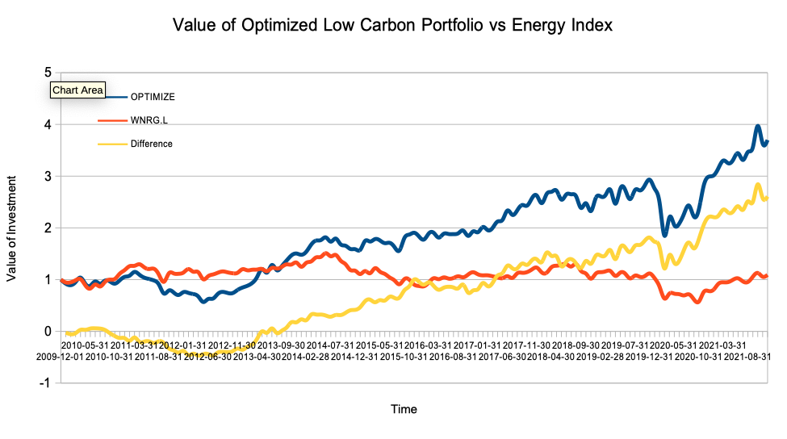
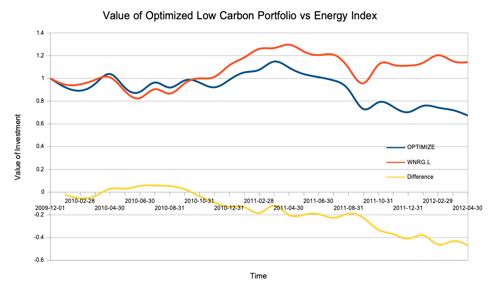
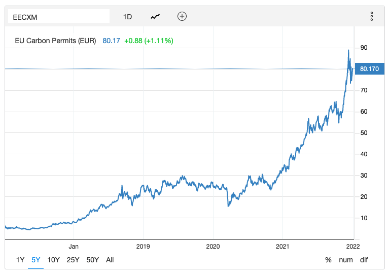

## Setting Benchmarks

_"Every battle is won before it is fought." - Sun Tzu_*

As a portfolio manager, I often felt like we were in the mud up front while our clients sat in castles miles away, obliviously sipping tea while giving us benchmarks that were out of touch with reality.  They would exclude out of favor assets that offered the best opportunities while piling into flavor of the month investments that offered few.  They wanted short-term results from investments that clearly required long-term time horizons. Finally, they would exclude perfectly safe investments while allowing highly risky ones on the basis of arbitrary ratings.  The last one, by the way, is exactly what caused the Credit Crisis and Great Recession of 2008 -- read [The Big Short](https://amzn.to/33TkSnl) by Michael Lewis.

Of course I was biased.  With a little time and experience being the client, I now see I was as rash as Hans Solo -- "Never tell me the odds."  But how could the client decide except by looking at the numbers?  Yet judging "by the numbers" alone could also lead to a short term, academic view of risk and return that would not only be bad for your long-term investment results but also have disastrous consequences for climate change and the economy as a whole.  

What we had was a failure to communicate.  Guidelines and benchmarks should be set in consultation with the portfolio manager, but the portfolio manager should also be humble enough to understand that the client has more at stake than the latest and greatest trade.

This chapter, then, is my attempt to bring the two sides together.  It's me the portfolio manager talking with me the investor, in the hope that we could integrate long-term thinking about climate change into the investment process.

The first thing we should all do is take a look at risk.  This chart shows the performance of the optimized zero carbon risk portfolio versus the Energy index from the previous chapter on [Structuring Portfolios](Structuring-Portfolios.md):

At first blush--The good guys won!  Everything worked out.  The climate aligned portfolio also way outperformed.  But how does this look?

Starting in 2010, after two and a half years in mid-2012, the optimized zero carbon risk portfolio would have been down nearly -47% versus the Energy index.  This was the dark valley of clean tech, after Solyndra went bankrupt and venture capital funding for clean tech practically came to an end in 2011.  A Harvard Business School article put it succinctly in [Clean Tech VC: A Decade of Failure](https://digital.hbs.edu/platform-rctom/submission/clean-tech-vc-a-decade-of-failure/): _In 2016, after nearly a decade and over $25 billion invested by L.P.’s,[11] 90% of clean tech investments can be considered abject failures, and close to 100% can be considered poor investments._

Or how about now?  The optimized zero carbon risk portfolio has outperformed the Energy index by a whopping 260% over the past decade.  Renewable energy stocks trade at two to three times the Price/Book ratios of the oil majors:

The oil stocks are rallying again.  The press is calling it an [ESG bubble](https://www.bloomberg.com/news/articles/2021-10-28/trillion-dollar-esg-boom-rings-bubble-trouble-alarm-in-new-study), because some [academic research papers](https://papers.ssrn.com/sol3/Papers.cfm?abstract_id=3929359) said that the outperformance is the result of favorable capital flows rather than fundamental.  

Do you stay the course?  

Warren Buffett famously said that "The true investor welcomes volatility."  But he has the rare luxury of time that most do not.  He invests with a faith in the long-term principles that is also backed up by a reputation and an investment vehicle that took decades to establish.  Most portfolio managers and their clients, the investment officers of pension fund, endowment, reinsurer, or private banks, would not be around to see the rebound after a 40% underperformance.  Even principals investing their own money usually have liquidity needs, as well as a partner who would (reasonably) question their sanity.  

Yet [Buffett and other great investors](http://mastersinvest.com/volatilityquotes) are right.  Great investments, like the transition to a low carbon economy, take time.  The path to get there could be rocky, but the long-term outcome is not in doubt.  Volatility is not risk but opportunity--if you could survive the journey.

So the first important consideration is how to get there.  In other words, how much volatility could you tolerate?  How much of an underperformance would cause you to lose the portfolio--by getting fired or being forced to liquidate?  Stop this from happening by sizing the risk properly, like we had discussed in the previous chapter on [Structuring Portfolios](Structuring-Portfolios.md).

Part of your decision will have to be based on actuarial analysis: How much contributions and withdrawals would be expected.  Make sure you will not be forced to sell to meet those obligations.  If you're making a leveraged bet on a long-term trend like climate change -- ___DON'T DO IT___.

A bigger part, though, is one of values.  Why are you making a climate-aligned investment?  Do you believe some companies will outperform during transition to a low carbon economy?  If so, what is the time horizon for this to happen?  Five years?  Ten?  Twenty?  Thirty years?  

Or do you believe that climate change is fundamentally harmful to the well being of your constituents, so that you cannot invest in companies that contribute to climate change?  In that case, then are broad market benchmarks such as the S&P 500 even relevant, since they contain companies that contribute to climate change?

Taken a step further, do your constituents agree with you?  Do they want you making this decision for them?  Do they agree with your analysis of which companies contribute to climate change, and which do not?

The more you are aligned with your constituents, the more they will be willing to ride through the cycles with you, and the greater volatility you will be able to bear on the road to your ultimate goals.

Assuming that you decide "Yes, this is fundamental to our investment policy," the next question is how to do it.  

Do you engage or divest?  

On the surface, it seems the answer is simple.  As the Harvard students who wrote an [open letter](https://divestharvard.medium.com/letter-to-harvard-corporation-on-its-2050-net-zero-pledge-a7260fd2e76) put it, "...engagement with the fossil fuel industry is dangerous and irresponsible. These companies are bad-faith partners in an effort towards decarbonization: their business models are predicated on continued extraction and exploitation of the world’s most vulnerable communities. They are not substantially transitioning to clean energy systems, have a record of attacking climate researchers (including Harvard’s own), and continue to block meaningful climate policy solutions..." 

Yet nothing in climate change is ever simple.  An article by Daniel Yergin, "[Why the Energy Transition Will Be So Complicated](https://www.theatlantic.com/international/archive/2021/11/energy-shock-transition/620813/)" points to that petroleum is so embedded in our world that many parts of our lives could not go on without them, not to mention the major countries whose economies are entirely dependent on oil and natural gas exports.      

As investors, there is one more problem with a pure divest strategy: Valuations.  Look again at the relative valuations of the oil companies versus renewables:

The market is already pricing in a hefty premium for the renewables companies.  Even in the course of a long transition to a low carbon world, if the oil companies just have a few "dead cat bounces," it would cause the kind of short-term underperformance discussed earlier.  And what if a few of them really did change their act and became viable in that low carbon world?  Removing them completely could be a costly, not to mention unnecessary, mistake.

Finally, where does the divesting stop?  Airlines?  Utilities?  Car manufacturers?  Companies who use plastic packaging like Coca Cola and Pepsi?  Freight carriers like UPS and Fedex?  Their customers like Amazon?  Amazon's customers like you and me?

It feels good to wash our hands clean and divest, but somewhere along the line, we all have to get down to the hard work:

Engaging.  

In 2015, after trying for several years, leading UK environmentalist Jonathon Porritt wrote "[It is 'impossible' for today’s big oil companies to adapt to climate change](https://www.theguardian.com/environment/2015/jan/15/it-is-impossible-todays-big-oil-companies-adapt-climate-change-jonathon-porritt)".  Yet we're still trying.  Last year, institutional investors of ExxonMobil banded together to elect new directors with a focus on climate change, despite intense management opposition.  Meanwhile, CEO'S of major oil companies have come together under the [Oil and Gas Climate Initiative](https://www.ogci.com) with the stated aims to "accelerate the industry response to climate change" and "explicitly support the Paris Agreement and its aims."
 
Will this do any good?  The UN Partnership for Responsible Investing's [collaborative engagement between major oil companies and their institutional investors](https://www.unpri.org/climate-change/engaging-oil-and-gas-companies-on-climate-results-of-the-pri-collaborative-engagement/6826.article) is a good summary of where the industry really is.  Twenty-five major oil companies sat down with institutional investors and other groups over a two and a half year period, and

- All the oil companies acknowledged that climate change as a significant issue for the business and have a policy commitment to act on it.
- 16 of the 25 have improved their climate disclosures.
- and 19 of the 25 have set long-term quantitative targets for reducing emissions.

But

- 15 of the 25 companies are only committing to reducing their operational emissions from extracting and refining (Scope 1 and 2) 
- Only 5 have targeted reducing Scope 3 emissions from the use of their products.
- Meanwhile, they all keep on drilling: "approximately 30%-40% of the engaged companies’ capex is unviable in a below 2˚C pathway."   

Reducing Scope 1 and 2 emissions from oil and gas production is no small potatoes.  [Methane flaring](https://www.iea.org/reports/flaring-emissions) causes 265 million tCO2e of GHG emissions each year, more than Florida or the Philippines and five to ten times that of Bitcoin.   

But is it realistic to think that's all there is for the industry to do?  I could just picture it now: A group of environmentalists go to a conference and ask an oil company to reduce their Scope 3 emissions from the use of oil and gas.  The company executives respond, "You caused those emissions by flying and driving here, staying at a hotel, and using the internet to organize.  So those emissions are on you."  Perhaps true technically, but then what?   

As countries implement carbon pricing and carbon prices rise, would there not be natural economic substitution to low carbon energy sources?  Would that then reduce the demand for the output of oil and gas companies?  Meanwhile, as oil companies continue to spend billions drilling for oil in the face of falling demand, they may be setting up a [carbon bubble](https://carbontracker.org/terms/carbon-bubble/)  Would they then fight to keep up demand for the oil, making climate change worse?  Or would they have to write off their assets, costing you billions in losses?  Or both?	
  
To be viable long-term, these companies must address more than just Scope 1 and 2 emissions.  They must address the Scope 3 emissions in a way that is acceptable globally, not just in the host countries where the companies operate.  Otherwise, they will all be much smaller as rising carbon prices, not to mention consumer boycotts, will cause the utilities to switch to renewables, airlines to switch to alternative fuels, and car manufacturers to switch to electric vehicles.   

As investors, then, you must make a call here--it's your job.  Do these companies in fact have a viable business model?

- Could they invest the cashflows from legacy oil and gas businesses in renewable energy _successfully_?
- Could they create a low or zero carbon energy product, using carbon capture and sequestration technology, hydrogen, or carbon offsets, that will be _acceptable_ in enough markets around the world?  
- Is there another use for their output, such as plastics, that will also be _acceptable_ to the general public?  
- Failing all of the above, will they reduce capex and return capital to shareholders?

If they do, then engage with them and help see these strategies through.  But if there is no viable strategy, or the companies will not pursue with them, then what exactly are we engaging to do?

Now that you've made the important long-term decisions, the next step is to work out a set of benchmarks for your portfolio managers.

The benchmark should incorporate your long-term climate strategy into a neutral index so that your portfolio managers would manage (and hopefully outperform) against it.  It should include the amount of climate-aligned difference or "tilt" versus standard indices such as the S&P 500 or MSCI World.  If you choose to divest from oil companies, they should not be in the index.  If you choose to engage with them, it should include only the companies that qualify for your engagement strategy.

Should portfolio managers vote proxies? 

Benchmarks -- ESG models - Are they correct?  Have they been too watered down?  Evaluating ESG-based indices.  Do they make sense?

If this sounds like a lot of work, let the Sage of Omaha inspire you:

_"There's no use running if you're on the wrong road. " - Warren Buffett_

#### Footnote

*The quote at the beginning is mistranslated.  The original Chinese, "胜可知，而不可为", means that the conditions for success are known in advance.  Once you have laid down the grounds for success, don't  force it.  It'll come to you.

