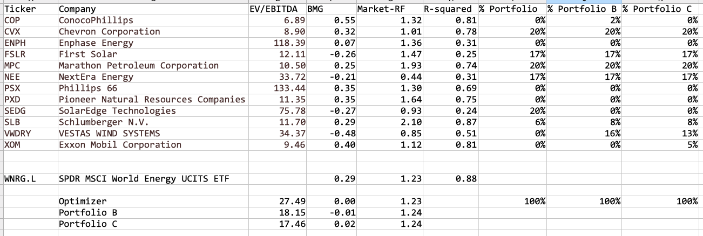
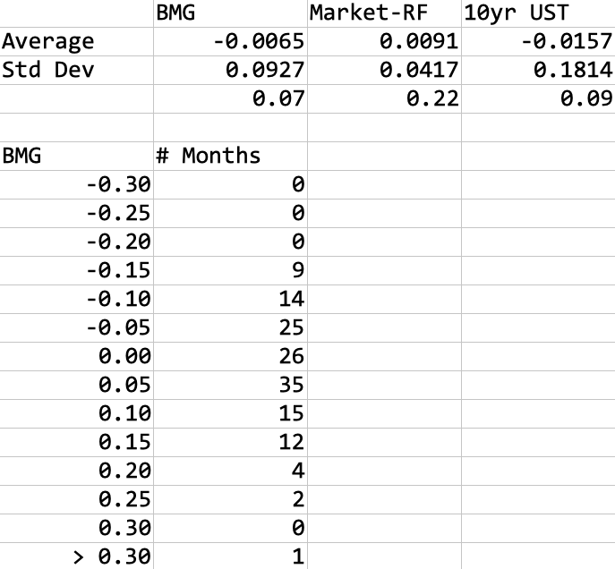
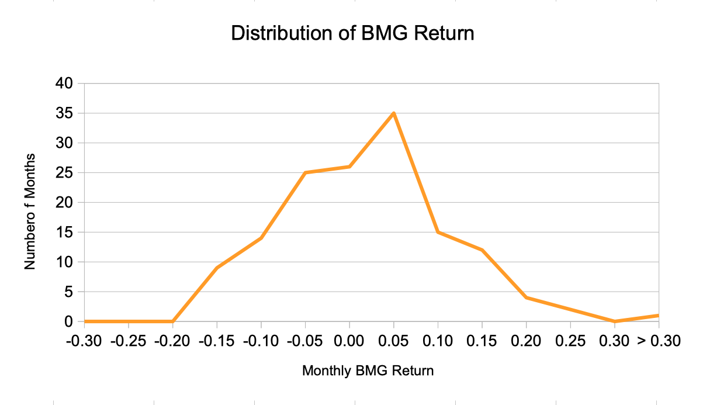

## Structuring Portfolios

_"I don't throw darts at a board. I bet on sure things." - Gordon Gekko_

More true stories.

Early in my career, a man came into office and said he was the heir to a hair care products fortune.  He was moving to Los Angeles and looking for an investment company to manage his money.  Would we be interested?

We weren't sure he was who he claimed to be.  (His hair didn't look good.)  But how much did we have to lose?  It was a great opportunity for the newbies (me) to sit in on an investment presentation by the firm's founders.

So there I sat in a conference room overlooking the Pacific ocean, listening to our founders talk about our investment management process and risk management.  The man nodded and smiled as we went on.  Then they all went to lunch, and I went back to work.

We never heard from the man again.  We called their family office.  He was not real.

Fast forward a few years.  I'm now in New York.  Another man (yes, they were both men) came recommended as the "shoo in" for the Governor of a major State.  He's meeting people in town today.  It would be a _really_ good idea for us to meet him.

So another conference room, this time overlooking the rooftops of the Manhattan skyline.  Now I'm one of the featured attractions.  We talked about our investment process and risk controls.  The man nodded and smiled.

A couple of weeks later, we got a letter on fancy bond paper inside a velum envelope.  He found what we talked about fascinating!  Would we support him to bring integrity back to government?  

We did not.  

He didn't become Governor of his State either.

Moral of the stories?  

Most institutional investment presentations are about the same:  Our firm has been around for (a long time) and specialize in (what you're looking at right now.)  We have really smart people (just listen to them) which do in depth analysis.  Just take a look at these examples of the (amount of industry knowledge | detailed financial analysis | sophisticated analytical models | impenetrable math | data mining and AI) we do.  On top of that, we overlay a disciplined risk control (look at these complicated charts.)  This is why we deliver you (consistent | high) returns, and here is a (client list) to prove it.

Which is not to say that the presentations aren't true.  In fact, most investment managers do follow a process like this, even if some of it is a little "aspirational" at times.  The difference is how it's done versus how plan sponsors and consultants may think it should be done.  As a portfolio manager, I always felt that they were too academic in how they viewed investing.  They seemed to believe the academics, who believe that sophisticated factor models are the answer: "My 3/5/7/13 factor model can explain all the return differences in returns and understand what the managers are doing better than they themselves do!"

Outside of a few high quant shops, though, most investors just don't think of things in factor terms.  We don't show up to work thinking "I got to adjust my HML today because I see a big move for low book value stocks next month."

Instead, we show up to work like shopaholics heading to the mall.  Most investors, whether individuals or big institutions, show up every morning looking to hunt down the latest bargains (those are your value investors), the latest and greatest (growth/momentum), or the truly unique, one-of-a-kind Sneakerhead finds (special situations, distressed, arbitrage.)  We then tuck away our finds and reminisce about how we found each bargain in our collection.  We can tell you exactly how it felt on the day we bought our favorite stock/bond/derivative years after the trade.  Even the ones who trade in esoteric derivatives are like that.  They just know their investments by serial numbers instead of company names, and think of them in terms of mathematical models instead of real people.  

For individual investors and funds managed by star stockpickers, that's usually it.  They know what they know, and they're so good at it, they don't need to bother with a little bit of everything else.  You never hear Uncle Harvey talk about his buying Microsoft, AOL, Facebook, or Tesla in the early days, then explain about the utilities and non-bank financials he bought to diversify his portfolio.  

At larger firms, there is (usually) some adult supervision involved, in the form of a Chief Investment Officer (CIO) or investment committee, or both.  They'll look over the portfolio and gather the key metrics, usually an overall risk measure (duration for bonds, market beta for stocks) and a sector breakdown.  These metrics are compared to the index that the portfolio is benchmarked against.  The adult supervision is there to make sure that the differences are reasonable, that the portfolio manager is not taking too much risk.  Here is where we could have some fun.

Some investment management firms's investment policies are extremely conservative.  They want no measurable difference versus the index.  All the return differences should only come from superior security selection.  But unless you knew something nobody else knew, this is like trying to turn lead into gold in markets with hundreds or even thousands of competitors.  

A few brave ones (Bill Gross and PIMCO come to mind) will proclaim that they believe the market will systematically go in one direction over the long term.  They then maintain a calculated bet against their benchmark.  It will result in greater short term volatility, and some clients will not take it.  Over time, though, if they're right, these long-term views will really boost returns.  The key is to make sure that your bets taken don't cause you to wipe out due to short term volatility.

Many others believe they can tactically trade against their benchmarks.  For example, generally overweight some sectors or go long the market, but take them off from time to time.  This is not easy, though, because markets could be quite volatile in the short term.

The great thing with climate investing is that given how little it is understood right now, there are several different ways to incorporate it into your investment process.

First, let's say you want to be pure stockpickers and want no systematic biases versus your benchmarks.  The carbon risk loadings that our model could identify is an additional way to find market anomalies that's not in the general know.  You could keep your portfolio aligned with your benchmark but have upside as climate change plays out.  Or you could even find stocks with the same carbon risk loadings as the market _right now_, but which could perform differently as their climate risks become better known.  Think of it as an option on climate risk embedded in your portfolio.

What's difficult about this approach, though, is that it requires the portfolio manager to be actively knowledgeable about climate risks in their day to day stockpicking.  Otherwise, it's like asking somebody to develop a sixth sense.  The typical manager is already looking at a lot of often contradictory variables: earnings, earnings growth, balance sheet leverage, and industry specific numbers like number of users, ARPU, churn, amount of real estate owned, barrels of proven reserves, etc. etc.  How does a new variable like carbon risk loading fit into it?  What's the time frame of carbon risk playing out, and how much of an impact would it have?

A more straightforward approach is for the CIO or investment committee to put on a controlled, long-term climate bet versus the benchmark by either underweighting specific high climate risk stocks in each sector or some key sectors that have high climate risk.  This is a four step process:

 * Calculate the volatility of carbon risk factor
 * Based on the volatility, size the bet -- How large a carbon risk loading different can we stomach against our benchmark, so that even in large moves against us, the performance will still be acceptable?  Essentially, this is a "Value at Risk" calculation.  For example, given a 2 standard deviation move in carbon risk factor in any year, should we limit the performance downside to 50 bps versus the benchmark?  This determines the amount of carbon risk loading difference we can maintain. 
 * Identify the stocks within each sector with the highest (lowest) carbon risk loadings that we could underweight (overweight)
 * Identify the sectors of the index with the highest (lowest) carbon risk loadings that we could underweight (overweight)

This is not as easy as it first sounds.  The choice of risk sizing could make or break your investment strategy.  Too little risk, and it won’t give you enough of a performance boost, but too much risk could cause to incur larger losses than expected.  If you’re managing against guidelines or using leverage, it could actually cause the loss of the client or wipe out of the portfolio.

Finally remember that measurements of volatility are themselves flawed.  Virtually all the academic research and risk models assume that asset prices are normally distributed, but in fact they are not.  Large movements — three, four, five standard deviation moves — are rare, but much more common than the million to one occurrences the models assume they are.  Short term movements are more volatile than longer term movements multiplied by the square root of time, which is what normally distributed volatilities mean.  Covariances between assets may hold steady in ordinary markets, but when start to hit the proverbial fan, all assets move together — down.  Even the hedges will move against you.

Taken together, this means that once in a long time events happen more often and with greater ferocity in the markets than the models predict.  When you make these kinds of bets against your benchmark, be careful.  Don’t oversize these long term core bets.

Then it's time for one of those meetings in the conference room.  Are we better off changing our selection of stocks to maintain the sector weightings, or changing our sector weightings?  This is where the portfolio manager's judgement on the individual stocks comes in.  If their opinion on the individual stocks goes along with the climate risk strategy, then you can realize your climate strategy through issue selection.  Otherwise, go with the sector weightings.

The last option, tactically trading the climate risk of the portfolio versus the benchmark, is really a trading strategy.  It should be attempted if there is a real reversal patterns in the price movements _and_ a fundamental reason why it's happening.  For example, if there's intervention or regulatory-driven trading in the market.  Otherwise, just be careful that you could get whipsawed by the noise.  Or worse, you could decide to sit it out and spend the rest of your life playing "Could have.  Should have.  If only."

Now let's look at some examples based on the model from the chapter on [Analyzing Investments](Analyzing-Investments.md).  

Here are those oil companies and renewable stocks again.  Let's say that you're managing against the Energy index--maybe you have an "Climate Transitions Energy Fund", or you're just the energy specialist in a team.

What do you do?

If you're a stock picker, you've probably already thought a lot about whether ConocoPhillips (COP) is better at a 6.89x EBITDA multiple or Chevron (CVX) better at a 8.9x EBITDA multiple.  Now add the fact that ConocoPhillips (COP) has a BMG factor loading of 0.32 and Chevron has a BMG factor loading of 0.55 to your thought process.  

If you're making a more strategic climate bet, then you might want to try to create a portfolio which will track your index but have a lower climate risk exposure.  As a very simple example, the index has a market factor loading (Beta) of 1.23 and a BMG factor loading of 0.29, so you could try to structure a portfolio with a market factor loading also of 1.23 but a BMG factor loading of 0.  Let's assume (again, just for example) you can put at most 20% into any stock and cannot short any stocks (not uncommon for pension funds.)  An optimizer could give you a portfolio which has an EBITDA multiple of 27.49.  A little off the targeted values could bring that down to the 17x - 18x EBITDA multiples range.  

How good is this bet?  Let's take a look at the distribution of the BMG series since 2010:

Interestingly, the BMG series has an average of -0.65% per month but a standard deviation of 9.27%.  The information ratio of the performance versus standard deviation is 0.07, compared to 0.22 for the stock market and 0.09 for long-term interest rates.  In other words, a lot of variability for the performance gain.  A look at the distribution of results shows that there were many periods where Brown stocks in fact outperformed:

If you structured your portfolio with a BMG factor loading of 0 versus 0.29 for the index, you could expect

 * An average outperformance of 0.29 * 0.65% = 0.19% per month
 * A tracking error or standard deviation of 2.69% per month
 * A 5% probability of a 4.9% underperformance 

That's the theory.  Now for a dose of reality: look at the low R-squared for the renewables stocks versus the oil companies.  This means that the model doesn't track their returns as well as the oil companies, so there could be a lot of times when your oil stocks are down, you think the renewables should be up, and they're not.  This is called "basis risk" -- the risk of your hedge not moving as expected against your risks.

An easy way to see how much basis risk there is is to run a simulation of the actual portfolio.  Here, we ran the optimized, zero climate risk optimized portfolio against the index and calculated the monthly relative returns:

In reality, there were more instances where the portfolio underperformed the Energy index by more than 5% in one month -- 19 months out of 144, or 13.2% of the time, nearly three times more often:

If this is shocking to you, welcome to the markets.  Correlation shifts, volatility drifts, and extreme market moves are just the realities that traders and portfolio managers deal with.  And if you recall from the [Analyzing Investments](Analyzing-Investments.md) chapter, this is when there is even some correlation between high and low climate risk stocks.  We found __no__ correlation, for example, be carbon credits markets and stock markets, so if you tried trading stocks against carbon credits such as the EUA futures, who knows where you'd end up.

And finally, half the stocks in your zero climate risk portfolio are oil companies!  Imagine the uproar!  It'll probably sound like [this debate at MIT about divesting from fossil fuel companies](https://mitsloan.mit.edu/ideas-made-to-matter/mit-divest-all-ideas-welcome-pursuit-one-big-goal)

Which brings us back to my original point in the [Introduction](Introduction.md): Climate investing is not the job of the portfolio manager.  Asset owners must specify their climate goals in the investment guidelines of their funds.  They must be willing to make those long term choices.  That is our topic for the next chapter. 

#### Disclaimer

_This content is published for informational purposes only and not investment advice or inducement or advertising to purchase or sell any security.  See [full disclaimer](Disclaimer.md)._
