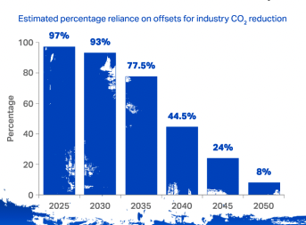

# Decarbonization DAO

## Why this DAO?

When you get on a flight, there's probably a checkbox to offset your emissions.  

But where does your money go?  What are these "offsets" the airline is offering to buy for you?  Does paying to "plant trees" really help the climate?  

Or is it just the airline's way of making you feel better?  

This DAO is an experiment in using open source to answer some big questions about climate, such as:
- What role do offsets have, if any?
- Are the companies we buy from really doing some about climate?

## Why Offsets Happen in the Dark

Nobody -- sellers, buyers -- want to disclose the prices.  Companies don't want to disclose what offsets used to be "carbon neutral."

Why?

Because we all know, deep down inside, they're not real.  

It's too good to be true!  

How could it cost only $1, $5, or $10 to offset a ton of CO2 when research shows they should cost at least $100 per ton to be effective.  So we buy them to meet government rules, put "carbon neutral" on a product, or just feel better about the flight we took.  Then we keep quiet about them.

Some would say the way to fix this is to make offsets easier to buy.  Easier to buy = more demand = higher prices.  This is generally true, but not in the case of offsets.  The problem with offsets is that they are not truly valid, if there's no "additionality" or hurdle for them, then an infinite supply of them could be issued at very low prices.  It's free money for a project developer whose project already pencils out economically.  

And of course, "easier to buy" usually means a lower price.  

But this is not just for fun.  Here's what at stake:  If done correctly, they could funnel much needed capital to developing markets and reduce emissions while the world transitions.  If done incorrectly, they are simply licenses to pollute and emit more CO2.  They're the placebo that will delay us from taking real action...until it's too late.

## What We Will Do

Offsets are necessary but they're not simple.  We can't figure this out by writing white papers or shouting at each other on twitter.  We can only figure this out by working on a specific use case.  

The Oxford Offsetting Principles sound great, but how does it really apply?  For every industry, a different solution is required.  A ton is not just a ton.  They must be used and aligned with the industry's emissions reductions.  In some cases, they simply should not be used.  In other cases, they are necessary as a bridge.

Where should we draw the line?  

This DAO will answer that from a real personal experiences air travel.  It is something many of us experience, yet it's also complicated and difficult to decarbonize.  IATA, for example, shows that offsets will play an important role for aviation for at least a decade ([source](https://www.iata.org/contentassets/b3783d24c5834634af59148c718472bb/factsheet_offsettingandcarboncapture.pdfv)):

But CORSIA's list of allowed offset is too broad.  It lets airlines "meet" their climate obligations for as little as $1 per ton of CO2 for a decade.  

So now is our chance to use our personal experiences to understand climate action at a deep level.  We'll voice our opinions, but very importantly, we'll buy offsets with our own money and stand behind them if they turn out to be invalid.  That makes us take them more seriously.  "Proof of stake." :)

The goal of this DAO is to leverage those experiences to develop analysis, software, and ultimately expertise about analyzing companies' emissions and climate strategies and the carbon offsets markets.  We will follow open source practices to be an inclusive, community-driven, and open group.  A DAO will help formalize the reputations earned and work done.  

Each member of the DAO commits to:
- Record their own travel emissions.
- Participate in discussions, such as what the right way to calculate emissions is or which offsets or sustainable fuels credits are legitimate.
- Vote on the issues we discuss.
- Purchase DAO-approved offsets or sustainable fuels credits, though not necessarily from the DAO or its members.
- If later the offsets or credits are shown to be invalid, replace them with new purchases.

This DAO is for serious climate thinkers only.  It's not for you if you're looking to ape a cryptocurrency or think climate is easy.  It's not for you if you're not willing to think seriously and objectively and change your mind when the facts require.  It's not for you if you're more interested in winning than getting closer to the Truth.

## The DAO's Business Model

The DAO is not here to make money selling offsets or credits.  Nor is it here to create a cryptocurrency for speculators.

Its long-term business model create business opportunities for its members based on their reputation and expertise.  Think of us as a decentralized TripAdvisor or Yelp for climate, and our members as climate influencers, but more legitimate and credible.   

Ultimately we want to build enough expertise and momentum to design and implement offset and decarbonization programs for companies big and small.

## Where We are Now

We're just getting started.  Right now we have some basic planning questions:
- Exactly what are we doing?  I really like the Oxford Offsetting Principles but think it's very general, so I thought it'd be good to apply it to a real use case -- offsetting our own travel emissions such as flights.  For example, what does "reduce emissions as much as possible" mean for an airline?  Should we try to calculate the emissions footprint of our airlines from their report?  Should we be rating the airlines based on their climate strategies and actual performance?
- What offsets or credits are applicable here?  Here I think we can eliminate whole categories.  CORSIA is way too permissive.  Can we buy tokens or credits of sustainable fuels?  Should we do it -- or are we just piling on to a scarce sector already?
-  Transparency of offsets - Should we publish our offset purchases on chain?
-  Output - Should we collectively vote and then publish our own analysis of airlines, offsets, and standards?
-  Governance - How exactly do we do all this?  Should we break each of these out into separate threads and then vote on them?  Should we do that on Discord or on github?

If you'd like to get invovled, join the #decarbonization-dao channel on [Discord](https://discord.gg/7jmwnTyyQ8)